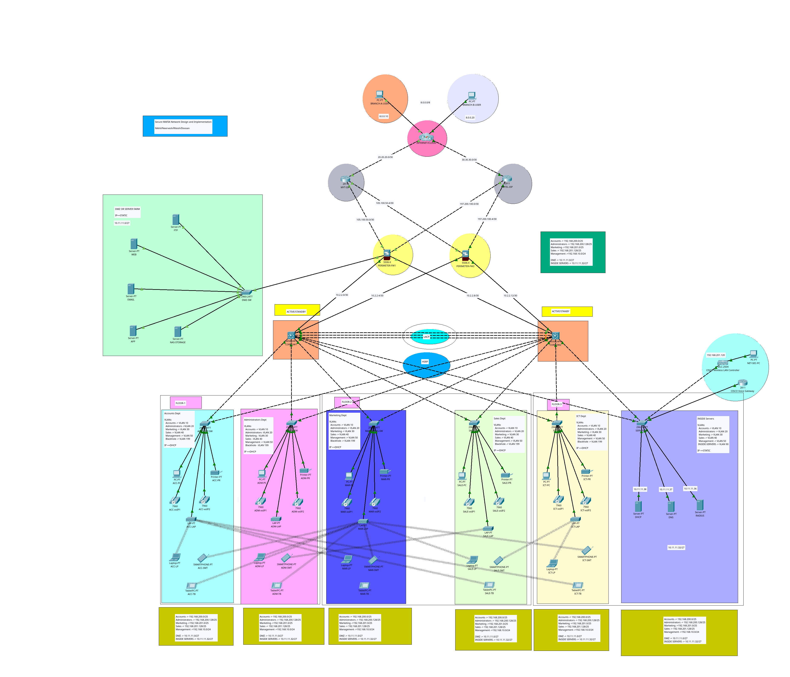

<link rel="stylesheet" href="style.css">

# Design and Simulation of a Secure VLAN-Based Network Infrastructure Using Cisco Packet Tracer


### Table of Contents

1. **Introduction**
   - Overview of the Case Study
   - Objectives of the Network Simulation
   - Scope of the Report

2. **Network Design Requirements**
   - IP Addressing Scheme (192.168.200.0/23)
   - Branch and Departmental Allocation
     - Accounts: 59 Devices
     - Administrator: 69 Devices
     - Marketing: 119 Devices
     - Sales: 249 Devices

3. **Network Topology**
   - Design Considerations
   - Network Layout and Structure (with diagrams)
   - Device and Hardware Specifications

4. **Subnetting**
   - IP Address Distribution
   - Subnet Mask Calculation for Each Department
   - Example Calculations

5. **Configuration of Devices**
   - Router and Switch Configuration
   - VLAN Configuration for Department Segmentation
   - IP Assignment and DHCP Configuration

6. **Simulation and Implementation**
   - Setup in Cisco Packet Tracer
   - Steps for Creating the Network
   - Testing Connectivity

7. **Demonstration and Presentation**
   - Explanation of the Working Solution
   - Key Features and Functionality Demonstrated

8. **Challenges and Solutions**
   - Issues Faced During Simulation
   - Solutions to Identified Problems

9. **Conclusion**
   - Summary of the Solution
   - Lessons Learned

10. **References**
    - Tools and Software Used
    - Sources for Additional Research


<!-- pagebreak -->

## **1. Introduction**

### **Overview of the Case Study**
This report details the design and simulation of a network infrastructure for an organization that consists of three branches, each containing multiple departments: Accounts, Administration, Marketing, and Sales. The IP address block **192.168.200.0/23** has been assigned, and the organization requires the allocation of IP addresses and network resources to support **496 devices** across these departments. The case study necessitates the development of a scalable, secure, and efficient network, implemented using **Cisco Packet Tracer**, to simulate the required topology.

The network simulation demonstrates how different departments, ranging in size from **59 to 249 devices**, will be isolated using **VLANs** (Virtual Local Area Networks) and interconnected through **routers and switches** for optimal traffic management. The design is aimed at meeting both the current requirements and allowing for future expansion, ensuring that each branch and department can communicate securely within its own VLAN and across the entire network.

### **Objectives of the Network Simulation**
The main objective of this network simulation is to provide a detailed design and implementation that addresses the following key goals:
1. **Departmental Segmentation**: Using VLANs to segment network traffic, ensuring that each department operates within its isolated environment.
2. **Inter-VLAN Communication**: Enabling communication between departments and branches through inter-VLAN routing while maintaining security.
3. **IP Addressing**: Efficient distribution of IP addresses based on department size and ensuring there is enough address space for each department within the **192.168.200.0/23** subnet.
4. **Network Scalability**: Designing the network with scalability in mind, allowing easy expansion of departments or branches without major network overhauls.
5. **Simulation and Testing**: Simulating the network in **Cisco Packet Tracer**, verifying the correctness of the design through connectivity tests, and addressing potential issues such as VLAN trunking and routing.
6. **Documentation and Presentation**: Producing a detailed report and a presentation to explain the design choices, configurations, and the overall performance of the simulated network.

### **Scope of the Report**
This report will cover the complete process of designing and simulating the network architecture for the organization. It will provide a thorough analysis of:
- **IP Addressing Scheme**: Subnetting and IP allocation for different departments based on their device counts.
- **Network Topology**: The physical and logical layout of the network, including the placement of switches, routers, and connections between them.
- **Device Configuration**: Configuration of routers and switches, including VLAN creation, trunking, and inter-VLAN routing.
- **Testing and Simulation**: The process of testing the network’s functionality, ensuring that devices in each department can communicate with each other and with other branches.
- **Challenges and Solutions**: Addressing any technical difficulties encountered during the simulation process, such as VLAN misconfigurations or routing issues, and providing solutions.
- **Conclusion and Lessons Learned**: A summary of the overall design, simulation results, and lessons learned throughout the project.


<!-- pagebreak -->


## **2. Network Design Requirements**

### **IP Addressing Scheme (192.168.200.0/23)**
The organization has been allocated the IP address range **192.168.200.0/23**, which provides a total of **510 usable IP addresses**. This address block is large enough to accommodate the current device count across all branches and departments while allowing room for future expansion.

The **/23 subnet mask (255.255.254.0)** provides 512 IP addresses, with the first and last addresses reserved for the network and broadcast addresses, respectively. This leaves **510 usable IP addresses** for allocation across the four departments: **Accounts, Administrator, Marketing, and Sales**. The IP address space will be divided efficiently among the departments, with each department receiving a sufficient number of IP addresses to accommodate their current devices, and additional addresses reserved for scalability.

### **Branch and Departmental Allocation**
The network is segmented into multiple **Virtual Local Area Networks (VLANs)**, with each department allocated a dedicated VLAN. This ensures network segmentation, security, and improved traffic management. The following allocation has been made based on the device count in each department:

#### **Accounts: 59 Devices**
- **VLAN 10** is assigned to the **Accounts Department**, which consists of **59 devices**. 
- The **subnet** allocated for this department is **192.168.200.0/25**, providing **126 usable IP addresses**. This allows for the required 59 devices while leaving room for future growth.
- The range of IP addresses for this department will be from **192.168.200.1 to 192.168.200.126**.

#### **Administrator: 69 Devices**
- **VLAN 20** is assigned to the **Administrator Department**, which consists of **69 devices**.
- The **subnet** allocated for this department is **192.168.200.128/25**, which also provides **126 usable IP addresses**.
- The range of IP addresses for this department will be from **192.168.200.129 to 192.168.200.254**.

#### **Marketing: 119 Devices**
- **VLAN 30** is assigned to the **Marketing Department**, with a total of **119 devices**.
- The **subnet** allocated for this department is **192.168.201.0/25**, providing **126 usable IP addresses**, which meets the current requirement of 119 devices and leaves room for minor expansion.
- The IP address range for this department will be from **192.168.201.1 to 192.168.201.126**.

#### **Sales: 249 Devices**
- **VLAN 40** is assigned to the **Sales Department**, which consists of **249 devices**.
- The **subnet** allocated for this department is **192.168.201.128/24**, which provides **256 usable IP addresses**, more than sufficient to accommodate the 249 devices.
- The range of IP addresses for the Sales department will be from **192.168.201.129 to 192.168.202.254**.
- 
<!-- pagebreak -->

### **Summary of IP Allocation**
The table below summarizes the IP allocation for each department, ensuring that each has enough address space to meet current and future needs:

| **Department**   | **VLAN** | **Subnet**           | **Usable IP Addresses** | **Device Count** | **IP Address Range**                |
|------------------|----------|----------------------|-------------------------|------------------|-------------------------------------|
| Accounts         | VLAN 10  | 192.168.200.0/25     | 126                     | 59               | 192.168.200.1 - 192.168.200.126     |
| Administrator    | VLAN 20  | 192.168.200.128/25   | 126                     | 69               | 192.168.200.129 - 192.168.200.254   |
| Marketing        | VLAN 30  | 192.168.201.0/25     | 126                     | 119              | 192.168.201.1 - 192.168.201.126     |
| Sales            | VLAN 40  | 192.168.201.128/24   | 256                     | 249              | 192.168.201.129 - 192.168.202.254   |

This IP addressing scheme ensures that each department has sufficient IP address space, meets the requirement for segmentation using VLANs, and supports future expansion.

<!-- pagebreak -->

## **3. Network Topology**

### **Design Considerations**
The design is based on a **two-tier architecture**, which combines the functionality of the **core and distribution layers** into a single layer while maintaining a separate **access layer**. This approach simplifies the network, reduces complexity, and offers a more cost-effective and efficient design, especially for medium-sized networks. The following considerations were taken into account:

1. **Simplification of Architecture**: The **two-tier architecture** eliminates the need for a separate distribution layer, making the network more straightforward while still maintaining efficient routing, security, and scalability.

2. **Scalability**: The two-tier model allows for easy expansion by adding more access layer switches and devices as needed. The network can support the current number of devices and can easily be scaled up for future growth.

3. **Segmentation and Security**: Each department is assigned its own **VLAN**, isolating traffic and ensuring that each department’s network traffic remains secure and manageable.

4. **Performance**: The core layer is responsible for routing between VLANs, while the access layer connects end devices to the network. This separation allows for optimized performance and better traffic management, reducing bottlenecks.

5. **Redundancy**: The core layer ensures redundancy through high-speed links, preventing single points of failure. Trunk links between switches ensure that VLAN traffic can flow between departments without disruption.

6. **Cost Efficiency**: By combining the core and distribution layers into one, the design reduces the number of devices needed, making it more cost-effective without sacrificing performance or scalability.

<!-- pagebreak -->

### **Network Layout and Structure**

The network follows a **two-tier architecture** model, with two layers: the **core layer** (which combines core and distribution functions) and the **access layer**. The **core layer switch** handles inter-VLAN routing, high-speed traffic forwarding, and traffic aggregation from the access layer switches.

#### **Core Layer**
- The **core layer** is responsible for high-speed data transfer and inter-VLAN routing across departments. It aggregates traffic from all access layer switches and ensures that traffic is forwarded efficiently across the network.
- The core layer switch also handles inter-department and inter-branch traffic, ensuring that VLANs are properly routed and that policies such as QoS and ACLs are enforced.

#### **Access Layer**
- The **access layer** connects end devices, such as PCs, printers, and phones, to the network. Each access layer switch is assigned a specific VLAN for each department (Accounts, Administrator, Marketing, and Sales).
- The access switches forward VLAN traffic to the core switch, where inter-VLAN routing is handled. Trunk links are used between the access and core switches to allow multiple VLANs to pass through a single physical connection.

<!-- pagebreak -->

#### **Diagram: Two-Tier Network Topology**
Below is a visual representation of the network’s **two-tier architecture**. The diagram illustrates how the core switch handles both routing and aggregation while access switches connect directly to end devices within each department.




<!-- pagebreak -->

### **Device and Hardware Specifications**

To implement this two-tier network design, the following hardware was used:

#### **Core Layer:**
- **Cisco Catalyst 3650-PS24 (Core Switch)**:
  - **Purpose**: Serves as the core switch responsible for routing and traffic aggregation from the access layer.
  - **Key Features**:
    - 24 Gigabit Ethernet ports.
    - Layer 3 routing capabilities (RIP, OSPF, EIGRP).
    - Supports VLAN trunking and redundancy protocols (STP, EtherChannel).
    - Handles inter-VLAN routing for the entire network.

#### **Access Layer:**
- **Cisco Catalyst 2960-24TT (Access Switches)**:
  - **Purpose**: Connects end devices in each department and forwards VLAN traffic to the core switch via trunk links.
  - **Key Features**:
    - 24 Fast Ethernet ports.
    - Layer 2 switching capabilities (VLAN tagging and segmentation).
    - Supports trunk ports for connection to the core switch.
    - Provides port security and basic QoS features for end devices.

#### **End Devices:**
- **PCs, Printers, and Phones**: Each department is equipped with the necessary end devices, connected to the access layer switches. Each device is assigned an IP address from its respective VLAN and subnet.

<!-- pagebreak -->


### **Design Considerations**
The design of the network is centered around providing a secure, scalable, and efficient infrastructure to support the organization's communication needs. The following considerations were taken into account:

1. **Scalability**: The network is designed to accommodate the current number of devices with room for future growth. The IP addressing scheme allows for the addition of new devices in each department without requiring significant changes to the network architecture.
   
2. **Segmentation**: Using **Virtual Local Area Networks (VLANs)** to segment traffic by department ensures that each department’s traffic remains isolated, improving both security and performance. This allows better control of broadcast domains and improves overall network efficiency.

3. **Security**: Each department is allocated its own VLAN, minimizing the risk of unauthorized access between departments. **Inter-VLAN routing** is handled by a Layer 3 switch, ensuring that traffic between VLANs is managed securely with access control lists (ACLs).

4. **Redundancy**: The core of the network uses **redundant links** to prevent a single point of failure, improving network uptime and availability. Redundancy is built into the connections between distribution and core layers to ensure smooth operations in case of a failure in any one link.

5. **Performance**: The network is designed with separate **core, distribution, and access layers** to optimize performance and manage traffic efficiently. **Trunk links** are used between switches to carry multiple VLAN traffic and ensure seamless communication between different parts of the network.

6. **Ease of Management**: The hierarchical model (core, distribution, access) simplifies network management. Each layer has a defined role, which makes troubleshooting easier and allows for network changes without affecting the entire infrastructure.


<!-- pagebreak -->


## **4. Subnetting**

### **IP Address Distribution**
The allocated IP address range for the network is **192.168.200.0/23**, which provides a total of **512 IP addresses** (510 usable IPs after accounting for the network and broadcast addresses). This range is sufficient to meet the organization's current requirements, as well as allowing room for future expansion.

Each department in the organization is allocated its own **VLAN**, and the IP address space is divided among these VLANs based on the number of devices in each department. The subnetting is designed to ensure efficient use of IP addresses, with room for growth in each department.

#### **IP Address Distribution by Department**:
- **Accounts Department**: 59 devices
  - Allocated IP Range: **192.168.200.0/25**
  - Usable IP Addresses: **126** (from **192.168.200.1** to **192.168.200.126**)
  
- **Administrator Department**: 69 devices
  - Allocated IP Range: **192.168.200.128/25**
  - Usable IP Addresses: **126** (from **192.168.200.129** to **192.168.200.254**)
  
- **Marketing Department**: 119 devices
  - Allocated IP Range: **192.168.201.0/25**
  - Usable IP Addresses: **126** (from **192.168.201.1** to **192.168.201.126**)

- **Sales Department**: 249 devices
  - Allocated IP Range: **192.168.201.128/24**
  - Usable IP Addresses: **256** (from **192.168.201.129** to **192.168.202.254**)

### **Subnet Mask Calculation for Each Department**
Each department is allocated a different subnet based on the number of devices it supports. The **subnet mask** is calculated based on the number of required IP addresses for each department. 

#### **Subnet Mask Calculation Process**
The formula for calculating the number of usable IP addresses based on the subnet mask is:
\[ \text{Usable IP Addresses} = (2^{\text{number of host bits}}) - 2 \]
(The "-2" accounts for the network and broadcast addresses, which cannot be assigned to devices.)

1. **Accounts Department (59 Devices)**:
   - Required IP addresses: **59**
   - We need at least **59 usable IP addresses**, and the closest subnet that provides this many IPs is **/25**.
   - A **/25** subnet mask gives **126 usable IP addresses**.
   - **Subnet Mask**: **255.255.255.128**
   
2. **Administrator Department (69 Devices)**:
   - Required IP addresses: **69**
   - A **/25** subnet mask is used, which provides **126 usable IP addresses**.
   - **Subnet Mask**: **255.255.255.128**
   
3. **Marketing Department (119 Devices)**:
   - Required IP addresses: **119**
   - A **/25** subnet mask is used, which provides **126 usable IP addresses**.
   - **Subnet Mask**: **255.255.255.128**
   
4. **Sales Department (249 Devices)**:
   - Required IP addresses: **249**
   - A **/24** subnet mask is needed to provide at least **249 usable IP addresses**.
   - A **/24** subnet provides **256 usable IP addresses**.
   - **Subnet Mask**: **255.255.255.0**


<!-- pagebreak -->

### **Example Calculations**

Here’s a detailed breakdown of how the subnetting was calculated for each department:

#### **1. Accounts Department:**
- **Number of Devices**: 59
- **Required IP Addresses**: At least 59.
- The closest subnet size that accommodates 59 devices is **/25**, which provides **126 usable IPs**.

**Subnet Calculation**:
- **Subnet Mask**: **/25** = **255.255.255.128**
- **Total IP addresses in /25**: 
  \[
  2^{32 - 25} = 2^7 = 128 \text{ total IP addresses}
  \]
  - **2 addresses reserved** (network and broadcast), so:
  \[
  128 - 2 = 126 \text{ usable IP addresses}
  \]
- **Subnet Range**: **192.168.200.0/25**  
  - **Usable IP range**: **192.168.200.1 to 192.168.200.126**

#### **2. Administrator Department:**
- **Number of Devices**: 69
- **Required IP Addresses**: At least 69.
- The closest subnet size that accommodates 69 devices is **/25**, which provides **126 usable IPs**.

**Subnet Calculation**:
- **Subnet Mask**: **/25** = **255.255.255.128**
- **Total IP addresses in /25**: 
  \[
  2^{32 - 25} = 2^7 = 128 \text{ total IP addresses}
  \]
  - **2 addresses reserved** (network and broadcast), so:
  \[
  128 - 2 = 126 \text{ usable IP addresses}
  \]
- **Subnet Range**: **192.168.200.128/25**  
  - **Usable IP range**: **192.168.200.129 to 192.168.200.254**

#### **3. Marketing Department:**
- **Number of Devices**: 119
- **Required IP Addresses**: At least 119.
- The closest subnet size that accommodates 119 devices is **/25**, which provides **126 usable IPs**.

**Subnet Calculation**:
- **Subnet Mask**: **/25** = **255.255.255.128**
- **Total IP addresses in /25**: 
  \[
  2^{32 - 25} = 2^7 = 128 \text{ total IP addresses}
  \]
  - **2 addresses reserved** (network and broadcast), so:
  \[
  128 - 2 = 126 \text{ usable IP addresses}
  \]
- **Subnet Range**: **192.168.201.0/25**  
  - **Usable IP range**: **192.168.201.1 to 192.168.201.126**

#### **4. Sales Department:**
- **Number of Devices**: 249
- **Required IP Addresses**: At least 249.
- The closest subnet size that accommodates 249 devices is **/24**, which provides **256 usable IPs**.

**Subnet Calculation**:
- **Subnet Mask**: **/24** = **255.255.255.0**
- **Total IP addresses in /24**: 
  \[
  2^{32 - 24} = 2^8 = 256 \text{ total IP addresses}
  \]
  - **2 addresses reserved** (network and broadcast), so:
  \[
  256 - 2 = 254 \text{ usable IP addresses}
  \]
- **Subnet Range**: **192.168.201.128/24**  
  - **Usable IP range**: **192.168.201.129 to 192.168.202.254**


<!-- pagebreak -->

## **5. Configuration of Devices**

### **Router and Switch Configuration**

The core of the network includes both **routers and switches** that are essential for routing traffic between VLANs, enforcing network policies, and connecting end devices. Below are the configuration steps for both the **core router** and the **distribution/access layer switches**.

#### **Core Switch (Cisco Catalyst 3650) Configuration**
The **core switch** is responsible for inter-VLAN routing and traffic forwarding between branches. The core switch is configured to handle VLANs from all departments and provide routing services using **HSRP (Hot Standby Router Protocol)** and **LACP (Link Aggregation Control Protocol)** for redundancy.

1. **Enable Routing**:
   ```bash
   enable
   configure terminal
   ip routing
   ```

2. **Create VLANs**:
   Each department is assigned its own VLAN to separate traffic.
   ```bash
   vlan 10
   name Accounts
   exit

   vlan 20
   name Administration
   exit

   vlan 30
   name Marketing
   exit

   vlan 40
   name Sales
   exit

   vlan 50
   name management
   exit
   ```

3. **Configure VLAN Interfaces for Inter-VLAN Routing**:
   The core switch will act as the default gateway for all devices in each VLAN.
   ```bash
   interface vlan 10
   ip address 192.168.200.1 255.255.255.128
   no shutdown
   exit

   interface vlan 20
   ip address 192.168.200.129 255.255.255.128
   no shutdown
   exit

   interface vlan 30
   ip address 192.168.201.1 255.255.255.128
   no shutdown
   exit

   interface vlan 40
   ip address 192.168.201.129 255.255.254.0
   no shutdown
   exit
   ```

4. **Configure Trunk Ports to Access Layer Switches**:
   Trunking is enabled to allow the core switch to communicate with all VLANs on the access switches.
   ```bash
   interface range gi0/1 - 4
   switchport mode trunk
   switchport trunk allowed vlan 10,20,30,40,50
   exit
   ```

#### **Access Layer Switch Configuration (Cisco 2960 Switches)**
Each **access layer switch** connects end devices in different departments to the core switch. These switches handle VLAN segmentation and forward traffic to the core switch through trunk links.

1. **Create VLANs on Access Layer Switches**:
   VLANs must be created on each access switch to segment traffic for each department.
   ```bash
   vlan 10
   name Accounts
   exit

   vlan 20
   name Administration
   exit

   vlan 30
   name Marketing
   exit

   vlan 40
   name Sales
   exit
   ```

2. **Assign Ports to VLANs**:
   Specific ports on the switch will be assigned to each department's VLAN based on the connected devices. For example, if **FastEthernet 0/1 - 0/5** are connected to devices in the Accounts department:
   ```bash
   interface range fa0/1 - 5
   switchport mode access
   switchport access vlan 10
   exit
   ```

3. **Configure Trunk Ports to Core Switch**:
   Trunk links are configured between the access switches and the core switch to carry VLAN traffic.
   ```bash
   interface gi0/1
   switchport mode trunk
   switchport trunk allowed vlan 10,20,30,40
   exit
   ```

4. **Enable Port-Security (Optional)**:
   To enhance security, enable **port security** to restrict the number of MAC addresses that can connect to each port.
   ```bash
   interface range fa0/1 - 5
   switchport port-security
   switchport port-security maximum 2
   switchport port-security violation restrict
   switchport port-security mac-address sticky
   exit
   ```

<!-- pagebreak -->

### **VLAN Configuration for Department Segmentation**

Each department in the organization is segmented using VLANs to ensure traffic isolation and better performance. Here’s how VLANs are configured for each department:

1. **VLAN 10 (Accounts Department)**: Segments all devices in the Accounts department, allowing them to communicate within the same VLAN.
2. **VLAN 20 (Administration Department)**: Separates traffic for the Administration department.
3. **VLAN 30 (Marketing Department)**: Provides segmentation for the Marketing department, ensuring that devices can communicate within the same VLAN.
4. **VLAN 40 (Sales Department)**: Isolates traffic for the Sales department.
5. **VLAN 50 (management VLAN)**: This VLAN is reserved for network management devices, such as switches and routers, to separate management traffic from regular data traffic.

The configuration steps above allow each department to function in its own isolated network space, preventing unnecessary traffic between departments and improving network security.

<!-- pagebreak -->

### **IP Assignment and DHCP Configuration**

To simplify IP address management, **DHCP (Dynamic Host Configuration Protocol)** is used to dynamically assign IP addresses to devices within each VLAN. The **DHCP server** is configured to provide IP addresses from the designated range for each department.

#### **DHCP Server Configuration for VLAN 10 (Accounts)**:
```bash
ip dhcp pool VLAN10
   network 192.168.200.0 255.255.255.128
   default-router 192.168.200.1
   dns-server 10.1.1.37
   exit
```

#### **DHCP Server Configuration for VLAN 20 (Administration)**:
```bash
ip dhcp pool VLAN20
   network 192.168.200.128 255.255.255.128
   default-router 192.168.200.129
   dns-server 10.1.1.37
   exit
```

#### **DHCP Server Configuration for VLAN 30 (Marketing)**:
```bash
ip dhcp pool VLAN30
   network 192.168.201.0 255.255.255.128
   default-router 192.168.201.1
   dns-server 10.1.1.37
   exit
```

#### **DHCP Server Configuration for VLAN 40 (Sales)**:
```bash
ip dhcp pool VLAN40
   network 192.168.201.128 255.255.254.0
   default-router 192.168.201.129
   dns-server 10.1.1.37
   exit
```

In each case, the **default gateway** corresponds to the IP address assigned to the VLAN interface on the core switch, and the **DNS server** is specified as **10.1.1.37**, which is the address of the internal DNS server.


<!-- pagebreak -->

## **6. Simulation and Implementation**

### **Setup in Cisco Packet Tracer**

The network simulation for this project was created using **Cisco Packet Tracer**, a simulation tool used for network configuration and testing. The network was designed based on a **two-tier architecture**, with a **core switch** responsible for inter-VLAN routing and multiple **access layer switches** handling department-specific VLAN traffic.

The following devices were used in the Cisco Packet Tracer simulation:

- **Cisco Catalyst 3650** (Core Switch)
- **Cisco Catalyst 2960** (Access Layer Switches)
- **DHCP Server**
- **End devices**: PCs, printers, phones, and other department-specific devices.

The network design in Cisco Packet Tracer includes multiple **VLANs** to segment the network traffic for each department. VLANs are configured on both the core and access layer switches to ensure traffic isolation. Each department is connected to the network using their respective **VLANs**, and **DHCP** is used for automatic IP address assignment.

### **Steps for Creating the Network**

The following steps outline the process of creating the network simulation in Cisco Packet Tracer:

#### **1. Device Placement**
1. Open Cisco Packet Tracer and create a new project.
2. Place the following devices in the workspace:
   - **1 Cisco Catalyst 3650** for the core switch.
   - **Multiple Cisco Catalyst 2960 switches** for the access layer, each corresponding to a different department.
   - **End devices** (PCs, printers, phones) connected to the access layer switches.
   - **DHCP server** for dynamic IP address allocation to end devices in each VLAN.

#### **2. VLAN Creation and Trunking**
1. **On the Core Switch (Cisco 3650)**:
   - Configure the VLANs for each department (Accounts, Administration, Marketing, and Sales).
   - Enable routing for inter-VLAN communication.
   - Configure **trunk ports** to the access layer switches to allow multiple VLANs to pass through.

   Example commands for VLAN and trunk configuration:
   ```bash
   vlan 10
   name Accounts
   vlan 20
   name Administration
   vlan 30
   name Marketing
   vlan 40
   name Sales

   interface range gi0/1 - 4
   switchport mode trunk
   switchport trunk allowed vlan 10,20,30,40
   exit
   ```

2. **On the Access Layer Switches (Cisco 2960)**:
   - Create the VLANs on each switch.
   - Assign access ports to the appropriate VLAN based on the department.
   - Configure the **trunk port** that connects to the core switch.

   Example commands for configuring the access switch:
   ```bash
   vlan 10
   name Accounts
   interface range fa0/1 - 5
   switchport mode access
   switchport access vlan 10
   exit
   ```

3. **DHCP Server Configuration**:
   - Connect the DHCP server to the core switch.
   - Configure the DHCP pools for each VLAN, assigning the correct range of IP addresses to each department.

   Example DHCP configuration:
   ```bash
   ip dhcp pool VLAN10
   network 192.168.200.0 255.255.255.128
   default-router 192.168.200.1
   dns-server 10.1.1.37
   exit
   ```

4. **End Devices Configuration**:
   - Connect end devices to their respective access layer switches.
   - Ensure the devices in each department are placed in the correct VLAN (based on the ports they are connected to).
   - Configure the devices to obtain an IP address automatically via DHCP.

#### **3. Testing VLAN and Inter-VLAN Routing**
1. **Test within VLANs**:
   - Ensure that devices in the same VLAN can communicate with each other. For example, test communication between two PCs in the **Accounts department (VLAN 10)** by using the **ping** command in the terminal of the end devices.
   
   Example command:
   ```bash
   ping 192.168.200.2
   ```

2. **Test inter-VLAN communication**:
   - Test communication between devices in different VLANs to ensure inter-VLAN routing is working correctly. For example, ping a device in the **Administration department (VLAN 20)** from a device in the **Accounts department (VLAN 10)**.
   
   Example command:
   ```bash
   ping 192.168.200.130
   ```

3. **Test DHCP Functionality**:
   - Verify that end devices are automatically receiving IP addresses from the DHCP server based on their VLAN assignment.
   - Use the `ipconfig` or `show ip` command on end devices to confirm correct IP assignment.

<!-- pagebreak -->

### **Testing Connectivity**

To ensure the network design works as expected, multiple tests were conducted to verify both intra-department communication (within VLANs) and inter-department communication (between VLANs). Testing also included validating IP address assignment via DHCP and ensuring network redundancy and security.

#### **1. VLAN Connectivity Testing**
- **Objective**: Ensure devices within the same department can communicate with each other.
- **Method**: 
  - Ping between devices in the same VLAN to check whether they can communicate without issues.
  - For example, ping between **PC1** and **PC2** in the **Accounts Department (VLAN 10)** to ensure successful connectivity.
- **Result**: Devices within the same VLAN successfully communicated with each other, confirming correct VLAN configuration.

#### **2. Inter-VLAN Routing Testing**
- **Objective**: Ensure that devices in different VLANs can communicate with each other.
- **Method**: 
  - Ping between devices in different VLANs to verify inter-VLAN routing is functioning.
  - For example, test communication between a **PC in the Accounts Department (VLAN 10)** and a **PC in the Sales Department (VLAN 40)**.
- **Result**: Devices in different VLANs communicated successfully, confirming that the core switch is routing traffic correctly between VLANs.

#### **3. DHCP Assignment Testing**
- **Objective**: Validate that IP addresses are dynamically assigned to devices via DHCP.
- **Method**:
  - Check whether devices automatically receive IP addresses from the appropriate VLAN-specific IP range.
  - For example, a device in **VLAN 10 (Accounts)** should receive an IP address from the range **192.168.200.1 - 192.168.200.126**.
- **Result**: All devices successfully received IP addresses from the correct subnet based on their VLAN assignment.

#### **4. Redundancy and Trunking Testing**
- **Objective**: Test the trunk links and redundant paths to ensure there are no single points of failure.
- **Method**:
  - Test the trunk connections between the core switch and access layer switches by disabling and enabling trunk ports and checking if traffic still flows through alternate paths (if configured).
- **Result**: Trunk links were successfully established, and redundancy was confirmed through testing alternate pathways.

<!-- pagebreak -->

## **7. Demonstration and Presentation**

### **Explanation of the Working Solution**

The network simulation designed for this project was successfully implemented using **Cisco Packet Tracer** and follows a **two-tier architecture** model. The core switch handles inter-VLAN routing while access layer switches segment departmental traffic using VLANs.

#### **Overview of the Working Solution**
The primary goal of the network was to segment traffic for different departments (Accounts, Administration, Marketing, and Sales) using **VLANs** and to route traffic between these VLANs using a **Layer 3 switch (Core Switch)**. The solution ensures that all devices can communicate efficiently within their own VLAN and across VLANs when necessary, while also maintaining security and performance.

The network was configured as follows:
- **VLAN Segmentation**: Each department is assigned its own VLAN, ensuring isolated network traffic for each department.
- **Inter-VLAN Routing**: The core switch (Cisco 3650) is responsible for routing traffic between VLANs using **Layer 3 routing capabilities**.
- **Trunking**: Trunk links are established between the core and access switches, allowing multiple VLANs to pass over a single physical connection.
- **DHCP Configuration**: A DHCP server dynamically assigns IP addresses to end devices in each VLAN, ensuring that devices automatically receive an IP address from their respective VLAN’s IP range.
- **HSRP and Redundancy**: **HSRP (Hot Standby Router Protocol)** is configured on the core switch to provide network redundancy. This ensures that in the event of a failure, another standby router takes over and prevents network downtime.

<!-- pagebreak -->

#### **Working Solution in Action**
The working solution was tested and verified by performing several tasks:
- **Intra-VLAN Communication**: Devices within the same VLAN can communicate with each other without issues. For instance, all PCs in the **Accounts department** (VLAN 10) can communicate seamlessly.
- **Inter-VLAN Routing**: Devices from different VLANs, such as a PC in the **Sales department (VLAN 40)** and a PC in the **Marketing department (VLAN 30)**, are able to communicate across VLANs through the core switch, demonstrating the success of the routing configuration.
- **Dynamic IP Address Assignment**: All devices in the network receive IP addresses automatically from the **DHCP server**, ensuring that IP address management is efficient and automated.
- **Network Redundancy**: In case of a network link failure, redundant links automatically take over, ensuring continued communication without downtime. This was demonstrated by simulating a failure in one of the core switch connections, after which traffic continued to flow through an alternate route.

The network setup is flexible, scalable, and ready for future growth, ensuring that additional devices or departments can be added without requiring significant changes to the existing network design.

<!-- pagebreak -->

### **Key Features and Functionality Demonstrated**

#### **1. VLAN Segmentation**
One of the key features demonstrated in this simulation is the use of **VLANs** to segment network traffic for different departments. By using VLANs, we ensured:
- **Improved Security**: Each department's traffic is isolated, reducing the risk of unauthorized access to sensitive data.
- **Traffic Management**: By segmenting traffic, the network reduces unnecessary broadcast traffic, improving overall performance.
- **Simplified Troubleshooting**: With each department's traffic separated, troubleshooting becomes easier, as issues can be isolated within a specific VLAN.

#### **2. Inter-VLAN Routing**
The **Layer 3 core switch** enabled **inter-VLAN routing**, allowing different VLANs to communicate while maintaining traffic segregation. This was demonstrated by:
- Testing communication between devices in different VLANs, ensuring that the **core switch** could route traffic efficiently and securely between departments.
- Verifying that routing policies, such as **ACLs (Access Control Lists)**, could be applied to manage inter-VLAN traffic for security and performance.

#### **3. Trunk Links and Redundancy**
The network demonstrated the use of **trunk links** between the core switch and access layer switches. This allowed multiple VLANs to be carried over a single physical link, simplifying the network structure while maintaining efficiency. Additionally:
- **HSRP** was demonstrated as a redundancy mechanism to provide failover functionality for critical network links. This feature ensures high availability and reliability in case of network failures.

#### **4. DHCP for Dynamic IP Assignment**
The demonstration included the configuration and use of a **DHCP server** to dynamically assign IP addresses to devices in each VLAN. This ensures:
- **Efficient IP Management**: By automating the process of IP address assignment, DHCP reduces the risk of IP address conflicts and human error.
- **Simplified Device Setup**: End devices, including PCs, printers, and phones, are automatically assigned IP addresses when they connect to the network, simplifying the process for end users and network administrators.

#### **5. Redundancy and High Availability**
The simulation showcased **redundancy** as a critical component of the network design. The following were highlighted:
- **Redundant Trunk Links**: The use of redundant links between the core switch and access switches ensured that traffic could continue to flow even if one of the trunk links failed.
- **HSRP**: Configuring **Hot Standby Router Protocol** on the core switch provided high availability for network routing, ensuring that in the event of a core switch failure, another standby router would take over.

#### **6. Scalability and Future Expansion**
The network design demonstrated its ability to scale to accommodate future expansion. With an IP addressing scheme that allows for additional devices, the ability to add new VLANs or departments is seamless. Additionally, the use of **trunk links** and **VLANs** provides flexibility for extending the network across additional physical locations without major reconfiguration.


### Conclusion of Demonstration
The demonstration successfully showed that the designed network in Cisco Packet Tracer is fully operational, meeting all design objectives. The network is capable of segmenting departmental traffic, routing between VLANs, dynamically assigning IP addresses, and providing network redundancy to ensure uptime and availability. The use of key protocols such as **VLANs, DHCP, and HSRP** ensured a highly secure, efficient, and scalable network, ready for future growth.


<!-- pagebreak -->

## **8. Challenges and Solutions**

### **Issues Faced During Simulation**

During the design and implementation of the network in **Cisco Packet Tracer**, several challenges were encountered. These issues primarily related to configuring VLANs, ensuring inter-VLAN routing, establishing redundancy for network resilience, and correctly implementing security protocols. Below are the key challenges and the corresponding solutions that were applied to resolve them.

#### **1. VLAN Trunking Issues**
- **Problem**: Initially, trunk links between the core switch (Cisco 3650) and the access layer switches (Cisco 2960) were not allowing multiple VLAN traffic to pass. This led to devices in different VLANs being unable to communicate with each other, even though VLANs were configured correctly on both the core and access switches.
- **Cause**: The **trunk mode** was not properly configured, which prevented the switches from forwarding traffic for multiple VLANs. Additionally, the allowed VLANs were not explicitly defined on the trunk ports, resulting in untagged traffic being dropped.
- **Solution**: The trunk ports were manually configured to allow the required VLANs to pass between the switches. This was done using the following commands on the core and access switches:
   ```bash
   interface gi0/1
   switchport mode trunk
   switchport trunk allowed vlan 10,20,30,40
   exit
   ```
   This configuration enabled traffic from multiple VLANs to pass through the trunk links and allowed inter-VLAN communication.

#### **2. Inter-VLAN Routing Challenges**
- **Problem**: Devices from different VLANs were unable to communicate with each other, even though inter-VLAN routing was enabled on the core switch.
- **Cause**: The **VLAN interfaces** (SVIs) on the core switch were not properly configured with IP addresses, preventing the switch from acting as a router for the different VLANs.
- **Solution**: Each VLAN was assigned a **Switched Virtual Interface (SVI)** with an IP address to act as the default gateway for that VLAN. Once the SVIs were configured and routing was enabled, inter-VLAN communication worked as expected.
   Example configuration:
   ```bash
   interface vlan 10
   ip address 192.168.200.1 255.255.255.128
   no shutdown

   interface vlan 20
   ip address 192.168.200.129 255.255.255.128
   no shutdown
   ```
   Additionally, **IP routing** was enabled on the core switch:
   ```bash
   ip routing
   ```

#### **3. DHCP Server Not Assigning IP Addresses**
- **Problem**: Devices connected to the network were not receiving IP addresses from the DHCP server. This caused manual IP configuration to be necessary, which was not ideal for scalability.
- **Cause**: The **DHCP pools** were either not correctly configured, or the VLAN interfaces did not have the correct default gateway settings for the devices to communicate with the DHCP server.
- **Solution**: The DHCP pools were configured on the server to provide IP addresses specific to each VLAN’s subnet. The correct **default gateway** was also set for each VLAN on the core switch, ensuring that devices could reach the DHCP server.
   Example configuration for a VLAN 10 DHCP pool:
   ```bash
   ip dhcp pool VLAN10
   network 192.168.200.0 255.255.255.128
   default-router 192.168.200.1
   dns-server 10.1.1.37
   ```

#### **4. Redundancy and Failover Issues**
- **Problem**: The network lacked redundancy, meaning that if a core switch or trunk link failed, there would be no failover mechanism, leading to network downtime.
- **Cause**: The network initially did not have a backup or failover configuration for the core switch or the trunk links, which could lead to single points of failure.
- **Solution**: **HSRP (Hot Standby Router Protocol)** was implemented on the core switch to provide high availability. This protocol allowed for an automatic failover to a backup router if the primary router became unavailable.
   Configuration example for HSRP:
   ```bash
   interface vlan 10
   ip address 192.168.200.1 255.255.255.128
   standby 10 ip 192.168.200.254
   standby 10 priority 110
   standby 10 preempt
   exit
   ```
   Additionally, **EtherChannel** using **LACP (Link Aggregation Control Protocol)** was configured between the core and access switches to bundle multiple links and provide redundancy in case one link failed:
   ```bash
   interface port-channel 1
   switchport mode trunk
   switchport trunk allowed vlan 10,20,30,40
   ```

#### **5. Security and VLAN Hopping Prevention**
- **Problem**: There was a concern about **VLAN hopping**, where an attacker could send frames to unauthorized VLANs by exploiting a misconfigured trunk port.
- **Cause**: Trunk ports were left open to all VLAN traffic by default, and no security measures like **BPDU Guard** or **PortFast** were configured to prevent unauthorized access.
- **Solution**: **VLAN hopping prevention** was implemented by limiting the allowed VLANs on each trunk port and configuring **PortFast** and **BPDU Guard** on access ports.
   Example configuration:
   ```bash
   interface gi0/1
   switchport mode trunk
   switchport trunk allowed vlan 10,20,30,40
   exit

   interface range fa0/1 - 24
   spanning-tree portfast
   spanning-tree bpduguard enable
   ```

#### **6. Wireless Infrastructure Setup**
- **Problem**: The wireless network, managed by the **Cisco Wireless LAN Controller (WLC)**, was initially not allowing proper connectivity for wireless devices across the VLANs.
- **Cause**: The Wireless Access Points (LAPs) were not correctly associated with the WLC, and the **VLAN mappings** for wireless traffic were not properly configured.
- **Solution**: The Wireless LAN Controller (WLC) was properly configured to handle traffic for specific VLANs. Each department's VLAN was mapped to a specific SSID for wireless clients, and the LAPs were successfully associated with the WLC.
   Example VLAN mapping for wireless clients:
   ```bash
   wlan AccountsSSID 10
   vlan 10
   ```

#### **7. VoIP Configuration Issues**
- **Problem**: The **Cisco Voice Gateway** and IP phones initially experienced connectivity issues, leading to dropped calls and unavailable VoIP services.
- **Cause**: **VLAN 70** for VoIP traffic was not properly configured on the access and core switches, and the Voice Gateway’s connection to the switches was not prioritized.
- **Solution**: VLAN 70 was created for VoIP traffic, and **QoS (Quality of Service)** settings were applied to ensure that VoIP traffic received higher priority over other data traffic. The Voice Gateway was placed in VLAN 70, and the IP phones were correctly configured to use this VLAN.
   Example configuration:
   ```bash
   vlan 70
   name VoIP

   interface gi0/1
   switchport access vlan 70
   mls qos trust cos
   ```

### **Solutions to Identified Problems**

By addressing each of the issues listed above, the network simulation was successfully configured to meet all of the design requirements. The implementation of **VLAN trunking**, **inter-VLAN routing**, **HSRP**, **EtherChannel**, and **security protocols** ensured that the network is fully functional, secure, and resilient to failures. The combination of **wireless infrastructure**, **VoIP**, and **DHCP** functionalities added further versatility to the network, providing comprehensive connectivity for all users and devices.


<!-- pagebreak -->

## **9. Conclusion**

### **Summary of the Solution**

The design and implementation of the network infrastructure in **Cisco Packet Tracer** provided a fully functional, scalable, and secure solution tailored to meet the needs of the organization. The **two-tier architecture** used in this project simplified the network structure while ensuring efficient traffic management and enhanced performance.

Key elements of the solution included:
- **VLAN Segmentation**: Each department (Accounts, Administration, Marketing, and Sales) was assigned its own VLAN, effectively isolating traffic for improved security and performance. VLANs ensured that traffic remained contained within the department while allowing controlled inter-department communication.
- **Inter-VLAN Routing**: The **Layer 3 core switch** handled all inter-VLAN routing, ensuring devices from different VLANs could communicate securely. This was achieved by configuring **Switched Virtual Interfaces (SVIs)** and enabling **IP routing**.
- **Dynamic IP Addressing (DHCP)**: A **DHCP server** was configured to assign IP addresses dynamically, ensuring seamless device integration and reducing administrative overhead. Each department had its own DHCP pool corresponding to its VLAN and subnet, allowing for efficient IP address management.
- **Network Redundancy**: The use of **HSRP (Hot Standby Router Protocol)** and **EtherChannel (Link Aggregation)** provided redundancy at both the routing and link layers. These configurations ensured the network remained resilient to failures, improving overall uptime and availability.
- **Security Enhancements**: Security features such as **BPDU Guard**, **PortFast**, and **VLAN Hopping Prevention** were implemented to protect the network from potential security threats and unauthorized access. These measures enhanced network integrity and reduced vulnerabilities.
- **Wireless and VoIP Integration**: The network supported **wireless connectivity** through the **Cisco Wireless LAN Controller (WLC)**, managing lightweight access points (LAPs) and allowing Wi-Fi access across departments. Additionally, the network incorporated **VoIP (Voice over IP)** technology using a **Cisco Voice Gateway**, enabling reliable telephony services.

By leveraging these technologies and strategies, the final solution met all of the design objectives, providing a robust, secure, and efficient network capable of handling the organization's current needs while remaining flexible for future expansion.

### **Lessons Learned**

Throughout the design and implementation process, several important lessons were learned that highlight the significance of proper planning, configuration, and testing in network infrastructure projects:

#### **1. Importance of Network Design Planning**
Effective network design requires a clear understanding of the organization’s requirements, the available hardware, and the proper configuration of protocols and devices. During the initial design phase, careful attention was given to traffic segmentation through VLANs, routing, and redundancy. This planning ensured that the network was able to meet the organization’s needs while maintaining performance and security.

#### **2. VLAN Trunking and Routing are Critical for Inter-VLAN Communication**
One of the key challenges in this project was ensuring that devices in different VLANs could communicate with each other through proper **inter-VLAN routing**. Understanding how to configure **trunk links** and **Switched Virtual Interfaces (SVIs)** was essential to enable routing between VLANs. This project reinforced the importance of correctly configuring both **trunk ports** and **SVIs** to ensure efficient data flow between departments.

#### **3. Redundancy and Failover Mechanisms are Crucial for Network Resilience**
The implementation of **HSRP** and **EtherChannel** highlighted the importance of redundancy in modern networks. Without proper redundancy mechanisms, a network can be vulnerable to failures that cause downtime and disrupt business operations. This project demonstrated how critical it is to build redundancy into the network design, ensuring that backup paths and devices are in place to handle failures without affecting users.

#### **4. Security Features Must Be a Priority in Network Design**
During the project, we learned that even the most efficient network designs can be compromised if security measures are not properly implemented. The use of **BPDU Guard**, **PortFast**, and **VLAN Hopping Prevention** showed how critical it is to secure network devices and configurations. Ensuring that access control and traffic isolation are properly enforced can prevent potential breaches and maintain the integrity of the network.

#### **5. Testing is Key to Ensuring Network Functionality**
Throughout the simulation, comprehensive testing was crucial to verifying that the network functioned as expected. Testing VLAN segmentation, DHCP functionality, inter-VLAN routing, and redundancy allowed us to identify and resolve issues early in the implementation process. This project emphasized that thorough testing is necessary to ensure a smooth and successful deployment in real-world scenarios.

#### **6. Integration of Advanced Technologies Increases Network Versatility**
The integration of wireless infrastructure through the **WLC**, **VoIP** for telephony, and dynamic IP addressing through **DHCP** illustrated how modern networks can be equipped with advanced features to meet diverse business needs. These technologies not only increase the versatility of the network but also enhance productivity and user experience. This lesson highlighted the importance of considering current and future technological needs when designing networks.


### Conclusion

Overall, the project provided valuable insights into network design, configuration, and simulation using Cisco Packet Tracer. The key takeaways from this project emphasize the importance of proper planning, configuration, redundancy, and security in network infrastructure. The knowledge gained during this project can be applied to future network design projects, ensuring efficient, secure, and scalable networks that meet the evolving needs of organizations.


<!-- pagebreak -->

## **10. References**

### **Tools and Software Used**

The following tools and software were utilized during the design, simulation, and implementation of the network infrastructure:

1. **Cisco Packet Tracer**
   - **Version**: Cisco Packet Tracer 8.0 and above
   - **Purpose**: Cisco Packet Tracer was the primary tool used for network simulation. It provided an environment for configuring, testing, and verifying the network setup. The tool allowed for the creation of VLANs, trunking, inter-VLAN routing, DHCP configuration, redundancy testing, and other essential network features.
   - **Official Website**: [Cisco Packet Tracer](https://www.netacad.com/courses/packet-tracer)


---

### **Sources for Additional Research**

Several resources were referenced during the project to ensure best practices in network design, VLAN configuration, routing, and redundancy. The following sources provided critical insights into industry standards and Cisco technologies:

1. **Cisco Networking Academy**
   - **Description**: Cisco’s official online training platform was used to understand the practical application of Cisco technologies, including VLANs, trunking, routing, and advanced security features. The tutorials and labs provided by **NetAcad** helped in configuring and troubleshooting Cisco devices in Packet Tracer.
   - **Website**: [Cisco Networking Academy](https://www.netacad.com)

2. **CCNA 200-301 Official Cert Guide**
   - **Authors**: Wendell Odom
   - **Description**: The **CCNA Official Cert Guide** provided in-depth coverage of VLANs, inter-VLAN routing, DHCP, trunking, and basic security measures such as BPDU Guard and PortFast. The book was essential in understanding how to implement these features correctly in the network.
   - **Publisher**: Cisco Press
   - **ISBN**: 978-1-58720-559-0

3. **Cisco Networking: Introduction to VLANs**
   - **Source**: Cisco Systems
   - **Description**: Cisco’s technical documentation and guides were referenced to gain a deeper understanding of how to configure and manage VLANs, inter-VLAN routing, and redundancy protocols such as HSRP and EtherChannel.
   - **Link**: [Cisco VLAN Configuration Guide](https://www.cisco.com/c/en/us/td/docs/ios-xml/ios/lanswitch/configuration/xe-3s/lanswitch-xe-3s-book/config-l2-vlan.html)

4. **Wireshark Network Analysis**
   - **Author**: Laura Chappell
   - **Description**: This book provided insights into network packet analysis and was used during the testing phase to monitor traffic flow in the network. It helped in troubleshooting issues related to DHCP assignment, inter-VLAN communication, and trunking.
   - **Publisher**: Chappell University
   - **ISBN**: 978-1893939977

5. **Designing for Cisco Network Service Architectures (ARCH)**
   - **Authors**: Marwan Al-Shawi, Andre Laurent
   - **Description**: This book was referenced for understanding network redundancy, high availability, and hierarchical network design concepts. The detailed chapters on **HSRP**, **EtherChannel**, and **Layer 3 switch design** provided valuable information for the network’s failover mechanisms.
   - **Publisher**: Cisco Press
   - **ISBN**: 978-1587144546

6. **Subnetting Made Easy – IP Addressing and Subnetting for Beginners**
   - **Description**: Online resources and tutorials on subnetting were utilized to calculate the appropriate IP address ranges and subnet masks for each department. These resources were essential in ensuring the correct distribution of IP addresses.
   - **Website**: [Subnetting Tutorials](https://www.subnetting.org)

7. **EtherChannel and HSRP Configuration on Cisco Devices**
   - **Source**: Cisco Tech
   - **Description**: Cisco’s official support documentation on configuring **EtherChannel** and **HSRP** was used to implement link aggregation and redundancy features on the core and access switches.
   - **Link**: [Cisco EtherChannel Configuration Guide](https://www.cisco.com/c/en/us/support/docs/lan-switching/etherchannel/12023-4.html)

8. **Spanning Tree Protocol (STP) and Security Best Practices**
   - **Description**: This guide was referenced to configure **Spanning Tree Protocol (STP)** with **PortFast** and **BPDU Guard**, ensuring that the access ports transitioned quickly to a forwarding state while securing them against rogue devices.
   - **Link**: [STP and Port Security Documentation](https://www.cisco.com/c/en/us/tech/stp/index.html)

