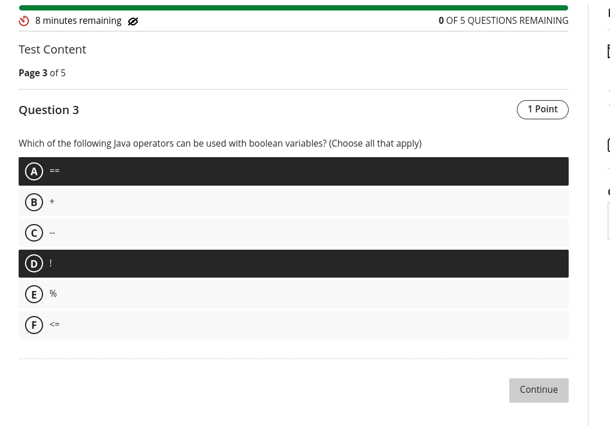
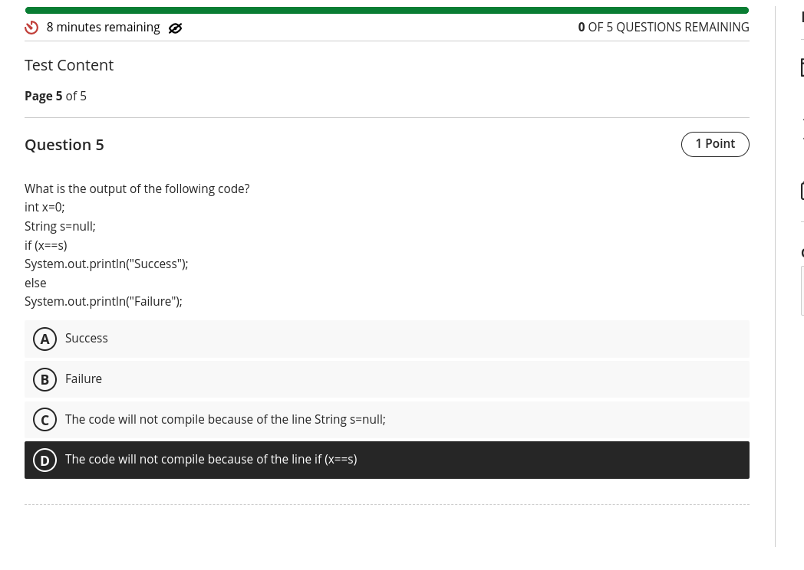

## Question 1

Based on the images provided, here is how you should match the iterative statements with their corresponding descriptions:

1. **for**: Repeats a block of code a specific number of times.
2. **while**: Repeats a block of code as long as a condition is true.
3. **do-while**: Repeats a block of code at least once, and then continues as long as a condition is true.
4. **foreach**: Iterates over all elements in an array or collection.

These are the correct answers for each statement.

---

## Question 2

The question asks which of the following are valid Java identifiers. The rules for Java identifiers are:

- Identifiers can only start with a letter (A-Z or a-z), a dollar sign ($), or an underscore (_).
- Subsequent characters may include digits (0-9), letters, dollar signs, or underscores.
- Identifiers cannot be a Java keyword (like `true`, `public`, etc.).
- Identifiers cannot start with a digit.

Let's evaluate each option:

- **A$B**: Valid (starts with a letter and includes valid characters).
- **_helloWorld**: Valid (starts with an underscore and includes valid characters).
- **true**: Invalid (it's a Java keyword).
- **java.lang**: Invalid (dot (.) is not allowed in identifiers).
- **Public**: Valid (Java is case-sensitive, so "Public" is not the same as the keyword "public").
- **1980_s**: Invalid (starts with a digit, which is not allowed).

So, the valid Java identifiers are:

- **A$B**
- **_helloWorld**
- **Public** 

These are the correct answers.

---

## Question 3

The question asks which of the following Java operators can be used with boolean variables. Let's evaluate each option:

- **==**: Yes, the equality operator can be used to compare boolean values.
- **+**: No, the addition operator is not applicable to boolean values.
- **--**: No, the decrement operator is not applicable to boolean values.
- **!**: Yes, the logical NOT operator can be used to invert the value of a boolean.
- **%**: No, the modulus operator is not applicable to boolean values.
- **<=**: No, the less than or equal to operator is not applicable to boolean values.

So, the correct operators that can be used with boolean variables are:

- **==**
- **!** 

These are the correct answers.

---
## Question 4

The statement "In Java programming, statements end in a semicolon" is **True**.

In Java, most programming statements must end with a semicolon (`;`), which signifies the end of the statement. This is a fundamental syntax rule in Java.

---

## Question 5

The code provided attempts to compare an integer (`x`) with a `String` (`s`), which is not allowed in Java. The comparison `if (x==s)` will cause a compilation error because Java does not support direct comparison between different data types like `int` and `String` without explicit conversion.

Therefore, the correct answer is:

- **D. The code will not compile because of the line if (x==s)**.

