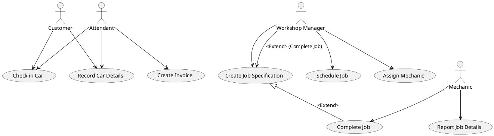
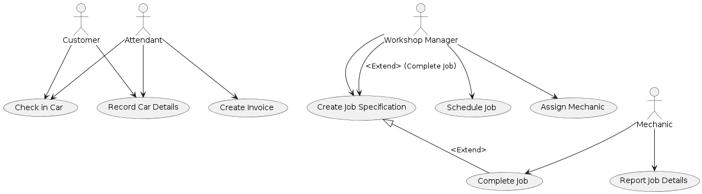
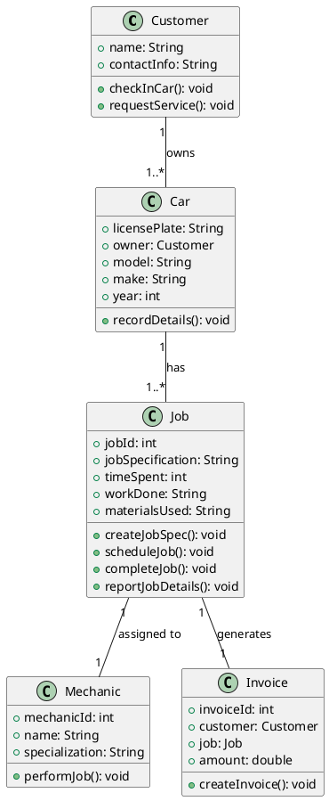
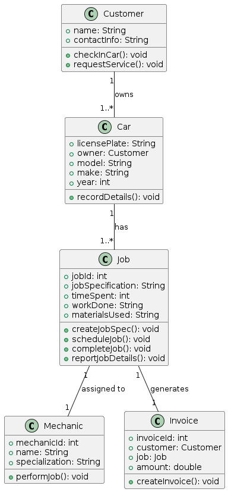

# Question 1

### a) Use of <<include>> relationship in use case diagram (5 marks)
**Description**: The <<include>> relationship is used to extract common behavior that is shared across multiple use cases into a separate use case. This helps in reusing the shared behavior and keeping the use case diagrams simple and organized.

**Example**: 
- **Scenario**: Online Shopping System
- **Use Case**: "Make Payment"
  - Common behavior such as "Validate Payment Information" can be extracted into a separate use case.
  - The "Make Payment" use case would include "Validate Payment Information".

### b) Use of <<extend>> relationship in use case diagram (5 marks)
**Description**: The <<extend>> relationship is used to add optional or conditional behavior to a base use case. This is useful for modeling optional features or variations in behavior that extend the main use case.

**Example**: 
- **Scenario**: Online Shopping System
- **Use Case**: "Place Order"
  - Optional behavior such as "Apply Discount" can be an extending use case.
  - The "Place Order" use case would be extended by "Apply Discount" only if the customer has a discount code.

### c) Use of generalization relationship in use case diagram (5 marks)
**Description**: The generalization relationship is used to show that one use case is a specialized version of another. This helps in modeling hierarchical relationships and inheriting behavior from a more general use case.

**Example**: 
- **Scenario**: Banking System
- **Use Case**: "Manage Account"
  - Specialized use cases such as "Manage Savings Account" and "Manage Checking Account" can inherit from the general "Manage Account" use case.
  - Both "Manage Savings Account" and "Manage Checking Account" inherit the common behavior from "Manage Account" but can also have their own specific behaviors.

### d) Advantages of agile methodology (4 marks)
1. **Flexibility and Adaptability**: Agile allows for changes to be made even late in the development process. This means teams can adapt to changing requirements and feedback more easily.
2. **Improved Customer Satisfaction**: Regular updates and iterations ensure that the customer is continuously involved and receives incremental value, leading to higher satisfaction.

### e) Disadvantages of agile methodology (4 marks)
1. **Lack of Documentation**: Agile methodologies often emphasize working software over comprehensive documentation, which can lead to insufficient documentation.
2. **Scope Creep**: Due to the flexible nature of agile, there's a risk of scope creep if the project lacks clear and well-defined boundaries and requirements.

### f) Main criterion for deciding whether or not to use the waterfall model (2 marks)
**Criterion**: The main criterion is the **stability and clarity of requirements**. If the project requirements are well-defined, stable, and unlikely to change, the waterfall model can be appropriate. This model works best when each phase of the project needs to be completed before moving on to the next, and there is a clear understanding of the final product from the beginning.

---

# Question 2

#### a) Use-Case Diagram

To draw the use-case diagram, we need to identify the main actors and use cases involved in the garage system.

**Actors**:
- Customer
- Attendant
- Workshop Manager
- Mechanic

**Use Cases**:
- Check in Car
- Record Car Details
- Create Job Specification
- Schedule Job
- Assign Mechanic
- Complete Job
- Report Job Details
- Create Invoice

Here's the PlantUML code for the use-case diagram:

#### b) Class Diagram

For the class diagram, we need to identify the main classes and their attributes and operations.

**Classes**:
- Customer
- Car
- Job
- Mechanic
- Invoice

**Attributes and Operations**:

- **Customer**
  - Attributes: name, contactInfo
  - Operations: checkInCar(), requestService()

- **Car**
  - Attributes: licensePlate, owner, model, make, year
  - Operations: recordDetails()

- **Job**
  - Attributes: jobId, jobSpecification, timeSpent, workDone, materialsUsed
  - Operations: createJobSpec(), scheduleJob(), completeJob(), reportJobDetails()

- **Mechanic**
  - Attributes: mechanicId, name, specialization
  - Operations: performJob()

- **Invoice**
  - Attributes: invoiceId, customer, job, amount
  - Operations: createInvoice()

Here's the PlantUML code for the class diagram:

---
### Question 3 

#### a) Need for Digital Transformation in Software Engineering Sector (5 marks)

**Reasoning**:
1. **Remote Work and Collaboration**: The COVID-19 pandemic has necessitated remote work, making digital tools essential for collaboration, communication, and project management. Digital transformation enables teams to work effectively from different locations.
2. **Increased Demand for Digital Solutions**: Many industries have accelerated their shift to digital platforms to continue operations during lockdowns and social distancing. This has increased the demand for software solutions, requiring the software engineering sector to adapt and innovate quickly.
3. **Automation and Efficiency**: Digital transformation facilitates the automation of repetitive tasks, improving efficiency and reducing errors. This is crucial for maintaining productivity and quality in software development.
4. **Enhanced Customer Experience**: As businesses move online, there is a need for robust, user-friendly, and reliable software to enhance customer experience. Digital transformation helps in meeting these evolving customer expectations.
5. **Data-Driven Decisions**: With digital tools, software engineers can leverage data analytics to make informed decisions, optimize processes, and improve the overall quality of the software products.

#### b) Ensuring Software Fits Required Specifications (6 marks)

**Steps to Ensure Fit**:
1. **Requirements Gathering**: Thoroughly gather and document the requirements from all stakeholders. Use techniques such as interviews, surveys, and workshops to ensure a comprehensive understanding of the needs.
2. **Clear Specifications**: Create clear, detailed, and unambiguous specifications. Use models like use-case diagrams, user stories, and acceptance criteria to ensure clarity.
3. **Prototyping and Feedback**: Develop prototypes and obtain feedback from stakeholders early in the development process. This helps in validating the requirements and making necessary adjustments before full-scale development.
4. **Iterative Development**: Use an iterative development approach, such as Agile, where the software is developed in small increments and reviewed frequently. This allows for continuous feedback and ensures alignment with the requirements.
5. **Testing and Validation**: Conduct thorough testing at each stage of development, including unit testing, integration testing, and user acceptance testing (UAT). Validate that the software meets the specified requirements.
6. **Traceability Matrix**: Maintain a traceability matrix to track the implementation of each requirement throughout the development process. This ensures that no requirements are missed and helps in verifying that all specifications are met.

#### c) Difference Between Black Box Testing and White Box Testing (6 marks)

**Black Box Testing**:
- **Focus**: Testing the functionality of the software without knowledge of the internal code structure. 
- **Objective**: Validate the software's behavior against the specified requirements.
- **Techniques**: Includes techniques like equivalence partitioning, boundary value analysis, and functional testing.
- **Tester**: Can be performed by testers who do not have programming knowledge.

**White Box Testing**:
- **Focus**: Testing the internal code structure, logic, and implementation of the software.
- **Objective**: Verify the internal operations of the software, ensuring that all paths, branches, and conditions are tested.
- **Techniques**: Includes techniques like statement coverage, branch coverage, path coverage, and unit testing.
- **Tester**: Requires knowledge of the programming and internal structure of the software, typically performed by developers or testers with programming skills.

#### d) Need for Integration Testing and Challenges (8 marks)

**Need for Integration Testing**:
1. **Verify Interactions**: Ensures that different modules or components of the software interact correctly. This is critical for identifying interface defects and ensuring seamless integration.
2. **Detect Issues Early**: Identifies issues that arise when integrating different modules, such as data format mismatches, incorrect data handling, and protocol errors, allowing them to be fixed early.
3. **Validate System Behavior**: Validates that the integrated system meets the specified requirements and behaves as expected when components work together.
4. **Enhance Reliability**: Increases the reliability and robustness of the system by ensuring that all components function together without issues.

**Challenges of Integration Testing**:
1. **Complexity of Interactions**: As the number of modules increases, the complexity of their interactions also increases, making it challenging to test all possible scenarios.
2. **Dependency Management**: Managing dependencies between modules can be difficult, especially when some components are not ready for testing or have dependencies on external systems.
3. **Data Integrity**: Ensuring data integrity and consistency across different modules can be challenging, particularly when dealing with complex data flows.
4. **Test Environment Setup**: Setting up a test environment that accurately reflects the production environment can be complex and time-consuming.
5. **Defect Isolation**: Identifying the source of defects can be challenging in an integrated system, as issues can arise from interactions between multiple modules.
6. **Resource Constraints**: Integration testing often requires significant time and resources, including skilled testers and appropriate tools, which may be limited in some projects.

---

### Question 4 

#### a) Functional and Non-Functional Requirements (6 marks)

**Functional Requirements**:
1. The client must enter their card and type their password (5 digits).
2. The system should allow the client to deposit money by entering the amount and putting the envelope in the machine.
3. The system should allow the client to withdraw money by entering the amount (multiple of 20).

**Non-Functional Requirements**:
1. Operations should take no longer than 10 seconds to keep customers from waiting.
2. The software should be ready by December 2024.
3. The software shall cost no more than Rs 5 million.

#### b) Importance of Stating What a System Should Do (4 marks)

**Reason**:
Stating what a system should do without stating how it should be done allows for flexibility in design and implementation. It provides clear objectives and requirements that the system must meet while allowing developers the freedom to use their expertise and creativity to determine the best way to achieve these goals. This approach also helps in ensuring that the requirements are understandable and testable, enabling better validation and verification.

#### c) Importance of Consulting Stakeholders and Four Stakeholders (4 marks)

**Reason for Consultation**:
Stakeholders should be consulted during the requirement engineering process to ensure that the system meets the needs and expectations of all parties involved. This helps in gathering comprehensive requirements, identifying potential issues early, and ensuring user satisfaction.

**Four Stakeholders**:
1. Bank Customers: End users who will interact with the ATM software.
2. Bank Employees: Including attendants and managers who will oversee the operation of the ATMs.
3. IT Department: Responsible for implementing and maintaining the ATM software.
4. Marketing Department: Interested in how the software can be used for promotional purposes, such as displaying ads.

#### d) Rewriting Vague Requirements (4 marks)

1. The system should have a response time of no more than 2 seconds for any operation.
2. The system should be capable of running on various operating systems including Windows, macOS, and Linux.
3. The system must have an uptime of 99.9% and should be able to recover from failures within 30 seconds.
4. The system must be user-friendly and require no more than 30 minutes of training for a new user to become proficient.

#### e) Difficulties in Requirements Elicitation and Analysis (4 marks)

1. **Stakeholder Availability**: Difficulty in getting time and commitment from all relevant stakeholders for meetings and discussions.
2. **Ambiguous Requirements**: Stakeholders may provide vague or unclear requirements that are hard to interpret correctly.
3. **Changing Requirements**: Requirements may change frequently due to evolving business needs or market conditions.
4. **Conflicting Requirements**: Different stakeholders may have conflicting requirements, making it challenging to reconcile their needs.

#### f) Benefits of Software Reuse to Developers (3 marks)

**Benefits**:
1. **Increased Productivity**: Reusing existing code reduces the time and effort required to develop new software, allowing developers to focus on other critical aspects.
2. **Improved Quality**: Reusing tested and proven code components enhances the overall quality and reliability of the software.
3. **Cost Efficiency**: Reduces development costs by minimizing the need for redundant coding, testing, and debugging efforts.