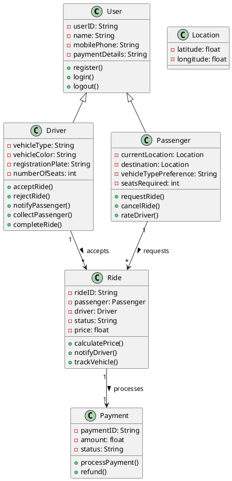
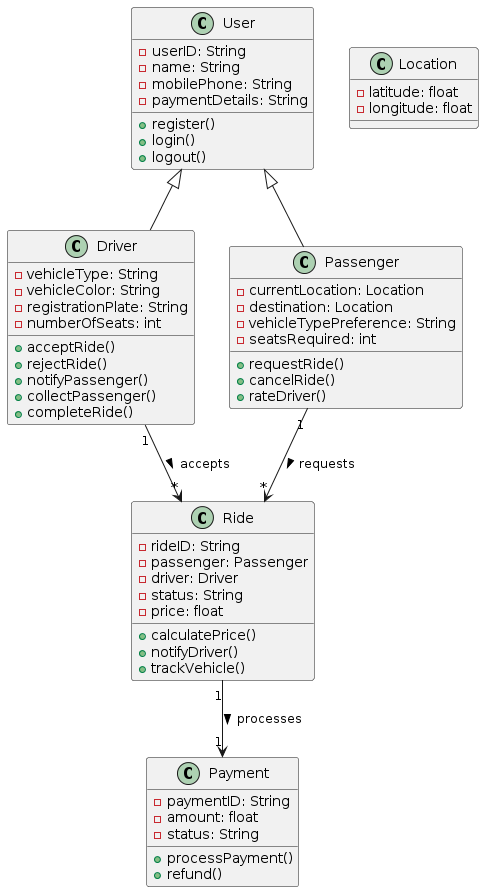
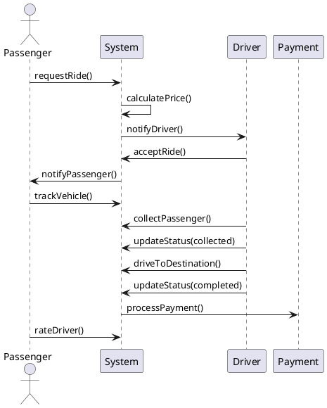
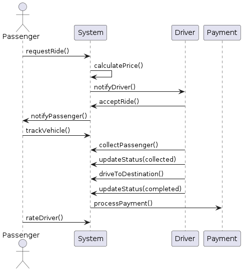

# Question 1

To address the given questions, we will create a class diagram to show the static structure of the ride-sharing system and a sequence diagram to illustrate the scenario of a passenger successfully requesting a ride and being driven to their destination.

### a) Class Diagram
Here is the class diagram for the ride-sharing system:

1. **User**
   - Attributes: userID, name, mobilePhone, paymentDetails
   - Methods: register(), login(), logout()

2. **Driver (inherits from User)**
   - Attributes: vehicleType, vehicleColor, registrationPlate, numberOfSeats
   - Methods: acceptRide(), rejectRide(), notifyPassenger(), collectPassenger(), completeRide()

3. **Passenger (inherits from User)**
   - Attributes: currentLocation, destination, vehicleTypePreference, seatsRequired
   - Methods: requestRide(), cancelRide(), rateDriver()

4. **Ride**
   - Attributes: rideID, passenger, driver, status, price
   - Methods: calculatePrice(), notifyDriver(), trackVehicle()

5. **Location**
   - Attributes: latitude, longitude

6. **Payment**
   - Attributes: paymentID, amount, status
   - Methods: processPayment(), refund()

### b) Sequence Diagram
The sequence diagram illustrating the scenario of a passenger successfully requesting a ride and being driven to their destination includes the following steps:

1. Passenger requests a ride.
2. System calculates the price and notifies available drivers.
3. Driver accepts the ride.
4. System notifies the passenger and provides driver's details.
5. Passenger tracks the vehicle.
6. Driver collects the passenger.
7. Driver updates the status to "collected".
8. Driver drives to the destination.
9. Driver updates the status to "completed".
10. Payment is processed automatically.
11. Passenger rates the driver.

Now, let's create and display these diagrams.

### Class Diagram

### Sequence Diagram

---

# Question 2

#### a) i. Discuss your colleague’s misunderstandings about iterative development.

Your colleague seems to misunderstand several key aspects of iterative development:

1. **Iterative Nature Misconception**:
   - Iterative development involves multiple cycles (iterations) where each iteration includes the full development cycle: analysis, design, implementation, and testing. Your colleague's view of having separate iterations for analysis, design, and construction contradicts the fundamental concept of iterative development.

2. **Fixing Bugs in Later Iterations**:
   - In iterative development, the goal is to produce a working version of the software at the end of each iteration. Waiting until later iterations to fix bugs is not ideal; instead, bugs should be identified and resolved within the same iteration to ensure a stable and incrementally improving product.

3. **Integration of Feedback**:
   - Iterative development relies on continuous feedback and refinement. By planning separate iterations for different phases, your colleague might miss the opportunity to integrate feedback from stakeholders early and throughout the process.

#### ii. Describe two (2) potential disadvantages of incremental delivery.

1. **Integration Complexity**:
   - Incremental delivery involves integrating new increments with existing functionality. As the project progresses, this integration can become complex and time-consuming, especially if the initial architecture is not well-planned to accommodate future increments.

2. **Incomplete System Visibility**:
   - With incremental delivery, stakeholders might not see the complete system until the final increments are delivered. This can make it difficult to assess the overall system's performance, usability, and functionality until late in the development cycle, potentially leading to missed requirements or misaligned expectations.

#### b) Suggest an appropriate development life cycle for this project. Justify your choice.

Given that the new project is similar to one completed last year, with a well-understood domain, stable requirements, and available resources, the **Waterfall Model** might be appropriate for this project. Here’s why:

1. **Predictability**:
   - Since the project requirements are well understood and not expected to change, the Waterfall model’s structured approach suits the project well. Each phase (requirements, design, implementation, testing, maintenance) is completed in a linear sequence, ensuring predictability.

2. **Clear Documentation**:
   - The Waterfall model emphasizes thorough documentation at each stage, which is beneficial for a project with stable requirements. It ensures all stakeholders have a clear understanding of the project scope and progress.

3. **Efficiency**:
   - Given that similar projects have been successfully completed before, the team can leverage previous experience and documentation to efficiently navigate each phase, reducing the likelihood of unexpected issues and rework.

4. **Resource Allocation**:
   - The clear phase distinction in the Waterfall model allows for effective resource allocation, ensuring that each team member knows their role and responsibilities at each stage of the project.

In summary, the Waterfall model’s structured and sequential approach is suitable for this project due to its predictability, efficiency, and the team's familiarity with similar projects.

---

# Question 3

#### a) Compare and contrast the main features and practices of the agile approach compared to traditional approaches at each of the key phases of the software development life cycle.

**1. Requirements Phase:**

- **Agile Approach:**
  - Requirements are gathered through user stories, which are brief descriptions of functionality from the perspective of the end-user.
  - Emphasizes collaboration with stakeholders for ongoing requirements gathering and refinement.
  - Requirements are prioritized in a backlog and are flexible, allowing for changes throughout the development process.

- **Traditional Approach:**
  - Requirements are gathered in a detailed and comprehensive document at the start of the project.
  - Typically involves lengthy meetings with stakeholders to finalize requirements before proceeding to the next phase.
  - Requirements are fixed and any changes require a formal change request process.

**2. Design Phase:**

- **Agile Approach:**
  - Design is iterative and incremental, with each iteration focusing on a small portion of the system.
  - Design evolves based on feedback from stakeholders and testing results.
  - Emphasizes simplicity and the design of minimal viable products (MVPs) that can be expanded upon in future iterations.

- **Traditional Approach:**
  - Design is done comprehensively and upfront before any coding begins.
  - Follows a detailed and rigid plan, often with extensive documentation.
  - Changes to the design are difficult and costly once the project progresses beyond this phase.

**3. Development Phase:**

- **Agile Approach:**
  - Development is done in short iterations or sprints, usually lasting 1-4 weeks.
  - Developers and stakeholders collaborate closely, with frequent builds and continuous integration.
  - Emphasizes working software over comprehensive documentation.

- **Traditional Approach:**
  - Development follows a linear and sequential process, often referred to as the "waterfall" model.
  - Coding begins only after the design phase is complete, and there is little stakeholder involvement until later stages.
  - Development is typically done in a single phase with a final build at the end.

**4. Testing Phase:**

- **Agile Approach:**
  - Testing is continuous and integrated throughout the development process.
  - Each iteration includes testing, ensuring that each increment is tested and functional.
  - Emphasizes automated testing to maintain the pace of development.

- **Traditional Approach:**
  - Testing occurs after the development phase is complete, often as a separate phase.
  - Relies heavily on manual testing and extensive test plans.
  - Bugs found late in the process can cause significant delays and require substantial rework.

**5. Deployment Phase:**

- **Agile Approach:**
  - Deployment is frequent, with each iteration potentially producing a deployable product increment.
  - Uses techniques like continuous delivery and continuous deployment to release updates frequently.
  - Allows for early and frequent feedback from users.

- **Traditional Approach:**
  - Deployment typically occurs once, at the end of the project after testing is complete.
  - Involves a significant amount of planning and coordination.
  - Feedback from users is only received after the product is fully deployed.

**6. Maintenance Phase:**

- **Agile Approach:**
  - Maintenance is ongoing, with continuous improvements and updates based on user feedback.
  - Agile teams remain engaged with the product, allowing for quick responses to issues and enhancements.

- **Traditional Approach:**
  - Maintenance is a distinct phase that begins after deployment.
  - Typically handled by a separate maintenance team rather than the original development team.
  - Updates and fixes follow a formal change management process.

#### b) Discuss how the clearly identifiable good practices in agile methodologies can be effectively incorporated into any software life cycle environment.

1. **Iterative Development:**
   - Implement short development cycles or iterations regardless of the overall methodology. This allows for regular feedback and incremental improvements, which can be incorporated into traditional models like Waterfall by breaking down phases into smaller cycles.

2. **Continuous Integration:**
   - Adopt continuous integration practices where code changes are frequently integrated and tested. This ensures early detection of issues and maintains a stable codebase, even in non-agile environments.

3. **Collaborative Approach:**
   - Foster close collaboration between developers, stakeholders, and users throughout the project. Regular meetings, such as stand-ups or progress reviews, can be introduced to maintain communication and align expectations.

4. **Automated Testing:**
   - Incorporate automated testing into the development process to ensure quality and reduce manual testing efforts. Automated tests can be run regularly to catch issues early, regardless of the development methodology.

5. **User Stories and Backlog Management:**
   - Use user stories to capture requirements and prioritize them in a backlog. This approach allows for flexibility in addressing changing requirements and can be adapted to traditional methodologies by revisiting the backlog at predefined intervals.

6. **Frequent Deliveries:**
   - Aim for frequent, smaller releases of the software to gather user feedback and make improvements. This can be done in traditional projects by planning for multiple release milestones instead of a single final release.

7. **Emphasis on Working Software:**
   - Prioritize delivering functional software over extensive documentation. Ensure that each phase or iteration results in a potentially deployable product, enhancing the focus on tangible progress.

By integrating these agile practices, any software life cycle environment can become more adaptable, responsive to change, and focused on delivering value to users efficiently.

---

# Question 4

#### a) List down the twelve (12) principles of the Agile Manifesto.

1. **Customer Satisfaction**:
   - Our highest priority is to satisfy the customer through early and continuous delivery of valuable software.

2. **Welcome Change**:
   - Welcome changing requirements, even late in development. Agile processes harness change for the customer's competitive advantage.

3. **Frequent Delivery**:
   - Deliver working software frequently, from a couple of weeks to a couple of months, with a preference to the shorter timescale.

4. **Collaboration**:
   - Business people and developers must work together daily throughout the project.

5. **Motivated Individuals**:
   - Build projects around motivated individuals. Give them the environment and support they need, and trust them to get the job done.

6. **Face-to-Face Conversation**:
   - The most efficient and effective method of conveying information to and within a development team is face-to-face conversation.

7. **Working Software**:
   - Working software is the primary measure of progress.

8. **Sustainable Development**:
   - Agile processes promote sustainable development. The sponsors, developers, and users should be able to maintain a constant pace indefinitely.

9. **Technical Excellence**:
   - Continuous attention to technical excellence and good design enhances agility.

10. **Simplicity**:
    - Simplicity—the art of maximizing the amount of work not done—is essential.

11. **Self-Organizing Teams**:
    - The best architectures, requirements, and designs emerge from self-organizing teams.

12. **Reflection**:
    - At regular intervals, the team reflects on how to become more effective, then tunes and adjusts its behavior accordingly.

#### b) What do you understand by the term ‘Scrum’?

Scrum is an agile framework for managing and completing complex projects. It is a process framework used primarily for software development, although it can be applied to other fields. Scrum emphasizes teamwork, accountability, and iterative progress towards a well-defined goal. It includes roles such as Scrum Master, Product Owner, and Development Team, and ceremonies like Sprint Planning, Daily Stand-up, Sprint Review, and Sprint Retrospective.

#### c) Explain how to plan and execute scrum sprints?

**Planning a Scrum Sprint:**

1. **Sprint Planning Meeting:**
   - **Objective:** Define what can be delivered in the sprint and how that work will be achieved.
   - **Participants:** Product Owner, Scrum Master, Development Team.
   - **Activities:**
     - **Product Backlog Review:** The Product Owner presents the prioritized backlog items.
     - **Sprint Goal Definition:** The team and Product Owner agree on the sprint goal.
     - **Task Breakdown:** The Development Team breaks down the selected backlog items into tasks.
     - **Capacity Planning:** The team assesses their capacity to ensure the sprint backlog is achievable.

**Executing a Scrum Sprint:**

2. **Daily Stand-up (Daily Scrum):**
   - **Objective:** Synchronize the team's work and plan for the next 24 hours.
   - **Participants:** Development Team, Scrum Master, optionally the Product Owner.
   - **Activities:**
     - Each team member answers three questions:
       - What did I do yesterday?
       - What will I do today?
       - Are there any impediments in my way?

3. **Development Work:**
   - The Development Team works on the tasks in the sprint backlog.
   - The Scrum Master helps remove any impediments.
   - Continuous collaboration and communication are maintained.

4. **Sprint Review:**
   - **Objective:** Demonstrate the work completed during the sprint to stakeholders.
   - **Participants:** Development Team, Scrum Master, Product Owner, Stakeholders.
   - **Activities:**
     - Team presents the increment (completed work).
     - Stakeholders provide feedback.
     - Product Backlog is updated based on feedback and new insights.

5. **Sprint Retrospective:**
   - **Objective:** Reflect on the past sprint to identify and implement improvements.
   - **Participants:** Development Team, Scrum Master, Product Owner.
   - **Activities:**
     - Discuss what went well, what didn't go well, and what can be improved.
     - Create a plan for implementing improvements in the next sprint.

By following these steps, the Scrum framework helps teams deliver incremental value, continuously improve their processes, and adapt to changing requirements and feedback.

---

# Question 5

#### a) Explain the purpose of each of the following different types of testing:

i. **Unit Testing**:
   - **Purpose**: Unit testing involves testing individual components or units of code to ensure they work as intended. It focuses on the smallest testable parts of an application, such as functions or methods, to verify that each unit performs correctly in isolation.

ii. **White Box Testing**:
   - **Purpose**: White box testing, also known as clear box or glass box testing, involves testing the internal structures or workings of an application. The tester has knowledge of the internal code structure and focuses on verifying the flow of inputs and outputs through the application, code paths, conditions, loops, and statements.

iii. **Black Box Testing**:
   - **Purpose**: Black box testing assesses the functionality of an application without peering into its internal structures or workings. The tester provides inputs and examines the outputs to ensure the software behaves as expected. This testing method is used to validate that the software meets the specified requirements and functions correctly.

iv. **Integration Testing**:
   - **Purpose**: Integration testing involves combining individual units or components and testing them as a group to identify any issues in their interactions. The goal is to detect problems that occur when units are integrated, such as interface mismatches or communication failures between modules.

#### b) Explain how the types of testing in part a) are used together.

These types of testing are used together to ensure comprehensive coverage and reliability of the software:

1. **Unit Testing** is the first level of testing where individual units are tested for correctness. By ensuring each unit works as expected, developers can build a solid foundation for more complex tests.
   
2. **Integration Testing** follows unit testing. Once units are verified to work individually, they are combined, and their interactions are tested to ensure they work together as intended. This helps catch issues that may not be evident when units are tested in isolation.

3. **White Box Testing** can be applied at various stages, especially during unit and integration testing, to verify the internal logic, code paths, and data flows. It complements black box testing by ensuring that internal operations are correct and optimized.

4. **Black Box Testing** is typically performed after integration testing to validate the software’s functionality against the requirements. It focuses on the external behavior of the application, ensuring it meets user expectations and requirements without considering the internal code structure.

Using these testing methods together allows for a thorough examination of both individual components and their interactions, covering both the internal and external aspects of the software. This layered approach helps identify and fix issues early in the development process, improving the overall quality and reliability of the software.

#### c) Explain what is meant by regression testing and why this is important in maintenance activities.

**Regression Testing**:
- **Definition**: Regression testing involves re-running previously completed tests on a modified software to ensure that recent code changes have not adversely affected the existing functionality. The goal is to verify that new updates, bug fixes, or enhancements do not introduce new defects or break existing features.

**Importance in Maintenance Activities**:
1. **Ensures Stability**: When software is updated or enhanced, regression testing helps ensure that these changes do not destabilize the existing system. This is crucial for maintaining the software’s reliability and user trust.

2. **Detects Side Effects**: Code changes can have unintended side effects on unrelated parts of the application. Regression testing helps detect these issues early, preventing them from reaching production.

3. **Maintains Quality**: Regular regression testing ensures that the software maintains a high level of quality over time. It helps catch any defects introduced by new changes, allowing for timely fixes.

4. **Validates Fixes**: When bugs are fixed, regression testing ensures that the fixes work as intended and do not cause new issues. It verifies that the software continues to meet its requirements after modifications.

5. **Supports Continuous Integration**: In environments with continuous integration and frequent updates, regression testing is essential to ensure that new code integrates smoothly with the existing codebase without causing regressions.

By performing regression testing regularly, especially during maintenance activities, organizations can ensure that their software remains functional, reliable, and of high quality, even as it evolves and grows.

---
# Question 6

#### a) What do you understand by the term Digital Transformation?

Digital Transformation refers to the comprehensive integration of digital technology into all aspects of a business, fundamentally changing how the business operates and delivers value to its customers. This process involves adopting digital tools and technologies to enhance processes, improve customer experiences, and foster a culture of innovation. Digital Transformation goes beyond merely upgrading technology; it includes reshaping business models, culture, and organizational strategies to thrive in a digital age.

#### b) Explain why during the pandemic of COVID-19, there has been a rise in demand for Digital Transformation by companies.

During the COVID-19 pandemic, there was a significant rise in demand for Digital Transformation by companies due to several reasons:

1. **Remote Work**: The pandemic forced businesses to adopt remote work models. Digital tools and platforms became essential for communication, collaboration, and maintaining productivity.
2. **E-commerce Surge**: With physical stores closed or restricted, there was a shift towards online shopping. Businesses needed to enhance their digital presence to cater to this surge.
3. **Customer Expectations**: Customers increasingly demanded digital interactions, from online shopping to digital customer service, driving companies to improve their digital capabilities.
4. **Operational Efficiency**: Digital Transformation enabled companies to streamline operations, reduce costs, and increase efficiency during uncertain times.
5. **Business Continuity**: Digital tools and cloud-based solutions ensured business continuity despite physical disruptions, allowing companies to continue operations and serve customers.

#### c) Explain the Digital Transformation framework.

The Digital Transformation framework is a structured approach that guides organizations through the process of transforming their operations and business models using digital technologies. Key components of the framework include:

1. **Vision and Strategy**:
   - Establishing a clear vision for Digital Transformation aligned with business objectives.
   - Defining strategic goals and metrics to measure success.

2. **Leadership and Culture**:
   - Ensuring strong leadership commitment to drive the transformation.
   - Fostering a culture of innovation, agility, and continuous learning.

3. **Customer Experience**:
   - Focusing on enhancing customer interactions and satisfaction through digital channels.
   - Leveraging data and analytics to understand and anticipate customer needs.

4. **Technology and Innovation**:
   - Adopting cutting-edge technologies such as AI, IoT, blockchain, and cloud computing.
   - Encouraging experimentation and innovation to stay ahead of competitors.

5. **Processes and Operations**:
   - Redesigning business processes to be more efficient and adaptable using digital tools.
   - Automating repetitive tasks and integrating digital workflows.

6. **Data and Analytics**:
   - Implementing robust data management practices to collect, store, and analyze data.
   - Using insights from data to drive decision-making and improve business outcomes.

7. **Governance and Risk Management**:
   - Establishing governance structures to oversee the transformation process.
   - Managing risks related to cybersecurity, data privacy, and compliance.

8. **People and Skills**:
   - Investing in upskilling and reskilling employees to equip them with digital competencies.
   - Building cross-functional teams to drive collaboration and innovation.

#### d) Do you think that Digital Transformation is an important aspect of Software Engineering? Justify your answer.

Yes, Digital Transformation is an important aspect of Software Engineering. Here are several reasons justifying this:

1. **Innovation**: Software engineering drives innovation by developing new digital solutions that transform business processes and customer experiences.
2. **Agility**: Digital Transformation requires agile methodologies and practices, which are fundamental to modern software engineering. This ensures faster development cycles and quicker adaptation to market changes.
3. **Scalability**: Software engineers create scalable systems and applications that can handle increased loads and user demands, which is essential for businesses undergoing digital transformation.
4. **Integration**: Digital Transformation involves integrating various digital tools and platforms. Software engineers play a crucial role in ensuring seamless integration and interoperability between systems.
5. **Data Management**: Effective Digital Transformation relies on data-driven decision-making. Software engineers develop systems for data collection, storage, analysis, and visualization.
6. **Security**: As businesses adopt digital technologies, ensuring cybersecurity becomes paramount. Software engineers design and implement secure systems to protect data and maintain trust.
7. **Customer-Centric Solutions**: Software engineers develop applications and platforms that enhance customer engagement and satisfaction, which are central to Digital Transformation efforts.

Overall, Digital Transformation and Software Engineering are deeply intertwined, with software engineering providing the necessary tools, methodologies, and expertise to drive successful Digital Transformation initiatives.
