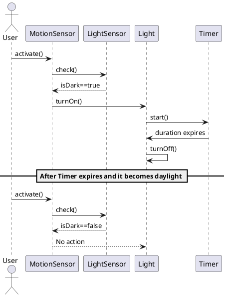
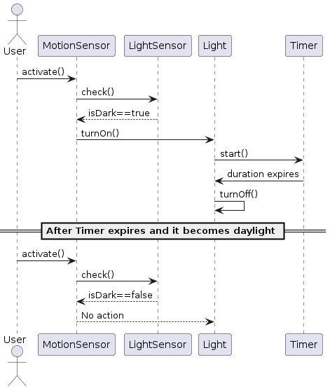

### Question 1 Answers

#### a) Class Diagram Description (12 marks)

**Description**:
The class diagram represents a security light system outside a building. The system includes four classes: `MotionSensor`, `LightSensor`, `Light`, and `Timer`.

**Class Descriptions**:

1. **MotionSensor**
   - **Attributes**: None
   - **Operations**: `activate()`
   - **Relationships**:
     - Activates one `Light` object.
     - Checks one `LightSensor` object.

2. **LightSensor**
   - **Attributes**: `daylight: boolean`
   - **Operations**: `check(): boolean`
   - **Relationships**:
     - Checked by one `MotionSensor` object.

3. **Light**
   - **Attributes**: None
   - **Operations**: `turnOn()`, `turnOff()`
   - **Relationships**:
     - Activated by one `MotionSensor` object.
     - Uses one `Timer` object.

4. **Timer**
   - **Attributes**: `duration: integer`
   - **Operations**: `start()`
   - **Relationships**:
     - Used by one `Light` object.

**Structural Constraints**:
- Each `MotionSensor` can activate only one `Light`.
- Each `MotionSensor` can check only one `LightSensor`.
- Each `Light` uses only one `Timer`.

#### b) Sequence Diagram (13 marks)

To draw the sequence diagram for the given scenario, we'll use the following assumptions:
1. The `MotionSensor` activates the `Light` only if `LightSensor` detects it is not daylight.
2. When the `Light` is turned on, the `Timer` starts.
3. The `Light` turns off after the `Timer` expires.
4. The `MotionSensor` does not activate the `Light` during daylight.

Here’s the PlantUML code for the sequence diagram:

This sequence diagram illustrates the behavior of the system when the user activates the `MotionSensor` during darkness and daylight, showing the interactions between the `User`, `MotionSensor`, `LightSensor`, `Light`, and `Timer`.

---

### Question 2 Answers

#### a) Five Stages of the Waterfall Model (10 marks)

1. **Requirements Analysis**:
   - **Description**: This stage involves gathering and documenting all the requirements for the system from stakeholders. It focuses on understanding what the users need from the system.
   - **Activities**: Requirement gathering, creating requirement specification documents, feasibility analysis.

2. **System Design**:
   - **Description**: Based on the requirements, the system's architecture and design are created. This includes defining the overall system architecture and the specific components.
   - **Activities**: High-level design, detailed design, database design, interface design, creating design documents.

3. **Implementation (Coding)**:
   - **Description**: The actual coding and development of the software take place in this stage. Developers write the code according to the design documents.
   - **Activities**: Writing code, unit testing, integration of modules, code reviews.

4. **Integration and Testing**:
   - **Description**: The individual units or modules are integrated and tested as a complete system to ensure that the system meets the specified requirements.
   - **Activities**: System testing, integration testing, user acceptance testing, debugging, performance testing.

5. **Deployment and Maintenance**:
   - **Description**: The system is deployed to the production environment and made available to users. Maintenance involves fixing bugs, updating the system, and adding new features as needed.
   - **Activities**: Deployment, user training, system maintenance, bug fixing, system updates.

#### b) Advantages and Disadvantages of Incremental Approach (9 marks)

**Advantages**:
1. **Flexibility**: Allows for changes and improvements at various stages of development. If new requirements emerge, they can be incorporated in later increments.
2. **Risk Management**: Reduces risk by identifying and addressing issues early. Problems can be detected and corrected in earlier increments.
3. **Customer Feedback**: Early increments can be presented to customers for feedback, ensuring that the project stays aligned with their needs and expectations.

**Disadvantages**:
1. **Complex Planning**: Requires careful planning and coordination to manage multiple increments. Each increment must be integrated with the previous ones, which can be complex.
2. **Resource Intensive**: May require more resources, as development and testing are repeated for each increment.
3. **Potential for Scope Creep**: Continuous addition of new requirements in each increment can lead to scope creep, potentially delaying the project and increasing costs.

#### c) Benefits and Problems of Using Prototypes in Software Development (6 marks)

**Benefits**:
1. **Requirement Validation**: Prototypes help in validating and refining requirements by providing a visual representation of the system, which can be reviewed by stakeholders.
2. **User Involvement**: Allows users to interact with a working model of the system early in the development process, ensuring that the final product meets their needs and expectations.
3. **Improved Communication**: Facilitates better communication between developers and stakeholders by providing a tangible model of the system, reducing misunderstandings.

**Problems**:
1. **Misleading Expectations**: Users may perceive the prototype as the final system and may not understand that it is just a model, leading to unrealistic expectations.
2. **Excessive Changes**: Frequent changes based on user feedback can lead to continuous modifications, which may delay the project and increase costs.
3. **Incomplete Analysis**: Relying too heavily on prototypes may lead to insufficient analysis of the system requirements and design, potentially overlooking critical aspects of the system.

---

### Question 3 Answers

#### a) Compare and Contrast Agile vs. Traditional Approaches at Key Phases of SDLC (15 marks)

**1. Requirements Gathering**

**Traditional Approach**:
- **Waterfall**: Requirements are gathered and documented in the initial phase. This documentation is comprehensive and forms the basis for the entire project.
- **Emphasis**: Stability and completeness of requirements before moving to the next phase.

**Agile Approach**:
- **Iterative and Incremental**: Requirements are gathered throughout the project. The initial requirements are documented, but they are continuously refined based on feedback.
- **Emphasis**: Flexibility and responsiveness to change. Customer collaboration is ongoing.

**Comparison**:
- **Traditional**: Emphasizes thorough, upfront requirements gathering.
- **Agile**: Emphasizes adaptability and continuous feedback.

**2. Design**

**Traditional Approach**:
- **Waterfall**: Detailed design phase follows requirements gathering. Design documents are created to outline the architecture and components of the system.
- **Emphasis**: Comprehensive and detailed design before implementation.

**Agile Approach**:
- **Iterative Design**: Design evolves with each iteration. Focus on creating just enough design to start coding.
- **Emphasis**: Simplicity and flexibility. Design decisions are revisited and refined based on actual implementation and feedback.

**Comparison**:
- **Traditional**: Emphasizes complete and detailed design upfront.
- **Agile**: Emphasizes evolving design with continuous refinements.

**3. Implementation**

**Traditional Approach**:
- **Waterfall**: Coding starts after the design is complete. Development follows a linear path with little room for changes.
- **Emphasis**: Following the detailed design documents strictly.

**Agile Approach**:
- **Incremental Development**: Coding happens in small, manageable increments. Each iteration results in a potentially shippable product.
- **Emphasis**: Rapid development and delivery of functional software.

**Comparison**:
- **Traditional**: Emphasizes a sequential approach to coding based on a fixed design.
- **Agile**: Emphasizes continuous development and integration of small increments.

**4. Testing**

**Traditional Approach**:
- **Waterfall**: Testing is a distinct phase that occurs after implementation. Extensive testing is done to ensure the system meets the requirements.
- **Emphasis**: Comprehensive testing after the system is fully developed.

**Agile Approach**:
- **Continuous Testing**: Testing is integrated into every iteration. Automated tests are often used to ensure continuous integration and delivery.
- **Emphasis**: Ongoing testing throughout the development process.

**Comparison**:
- **Traditional**: Emphasizes testing as a final phase.
- **Agile**: Emphasizes continuous testing and integration.

**5. Deployment and Maintenance**

**Traditional Approach**:
- **Waterfall**: Deployment occurs after the entire system is fully tested and accepted. Maintenance involves fixing bugs and making updates.
- **Emphasis**: Stability and thorough documentation for future maintenance.

**Agile Approach**:
- **Frequent Releases**: Deployment happens at the end of each iteration. Maintenance is part of the continuous development process.
- **Emphasis**: Frequent delivery of updates and improvements.

**Comparison**:
- **Traditional**: Emphasizes a single, comprehensive deployment.
- **Agile**: Emphasizes frequent, incremental releases.

#### b) Incorporating Good Practices in Agile Methodologies into Any Software Life Cycle (10 marks)

**1. Iterative Development**
   - **Practice**: Develop software in small, manageable increments.
   - **Incorporation**: Any software life cycle can adopt iterative development by breaking down the project into smaller parts and delivering them incrementally.

**2. Continuous Integration**
   - **Practice**: Frequently integrate and test changes to ensure the software works well as a whole.
   - **Incorporation**: Implement automated testing and integration tools to support continuous integration regardless of the development model.

**3. Customer Collaboration**
   - **Practice**: Engage customers and stakeholders continuously for feedback and validation.
   - **Incorporation**: Regularly schedule review meetings and feedback sessions with stakeholders to ensure the project meets their needs and expectations.

**4. Adaptability to Change**
   - **Practice**: Be open to changes in requirements and adjust the project plan accordingly.
   - **Incorporation**: Incorporate change management processes that allow for flexibility and adaptation within the project's scope and timeline.

**5. Emphasis on Working Software**
   - **Practice**: Prioritize delivering functional software over extensive documentation.
   - **Incorporation**: Focus on producing working software at regular intervals, ensuring that each phase or iteration results in a usable product.

**6. Team Collaboration and Communication**
   - **Practice**: Foster a collaborative environment with open communication among team members.
   - **Incorporation**: Use collaborative tools and techniques such as daily stand-ups, sprint planning, and retrospectives to enhance team communication and coordination.

**7. Automated Testing**
   - **Practice**: Use automated tests to ensure quality and speed up the testing process.
   - **Incorporation**: Integrate automated testing frameworks and tools into the development process to continuously verify the functionality of the software.

By incorporating these agile practices into any software development life cycle, organizations can benefit from increased flexibility, improved quality, and faster delivery of software products.

---

# QUESTION 4

### a) List down the twelve (12) principles of Agile Manifesto. (12 marks)

1. **Customer satisfaction through early and continuous delivery of valuable software.**
   - Our highest priority is to satisfy the customer through early and continuous delivery of valuable software.
2. **Welcome changing requirements, even late in development.**
   - Agile processes harness change for the customer's competitive advantage.
3. **Deliver working software frequently, from a couple of weeks to a couple of months, with a preference to the shorter timescale.**
4. **Business people and developers must work together daily throughout the project.**
5. **Build projects around motivated individuals.**
   - Give them the environment and support they need, and trust them to get the job done.
6. **The most efficient and effective method of conveying information to and within a development team is face-to-face conversation.**
7. **Working software is the primary measure of progress.**
8. **Agile processes promote sustainable development.**
   - The sponsors, developers, and users should be able to maintain a constant pace indefinitely.
9. **Continuous attention to technical excellence and good design enhances agility.**
10. **Simplicity—the art of maximizing the amount of work not done—is essential.**
11. **The best architectures, requirements, and designs emerge from self-organizing teams.**
12. **At regular intervals, the team reflects on how to become more effective, then tunes and adjusts its behavior accordingly.**

### b) What do you understand by the term ‘Scrum’? (3 marks)

**Scrum** is a framework within which people can address complex adaptive problems, while productively and creatively delivering products of the highest possible value. It is a lightweight, simple-to-understand framework that is designed for effective team collaboration on complex projects. It involves a set of roles (Scrum Master, Product Owner, and Development Team), events (Sprints, Sprint Planning, Daily Scrum, Sprint Review, and Sprint Retrospective), and artifacts (Product Backlog, Sprint Backlog, and Increment) that guide teams in iterative and incremental development.

### c) Explain how to plan and execute scrum sprints. (10 marks)

1. **Sprint Planning:**
   - **Objective Setting:** The team defines the sprint goal, a concise statement of what they aim to achieve.
   - **Backlog Refinement:** The Product Owner presents the prioritized Product Backlog items. The team selects items they commit to completing during the sprint.
   - **Task Breakdown:** The team breaks down each selected backlog item into smaller tasks and estimates the effort required for each task.

2. **Daily Scrum:**
   - A short (15-minute) meeting held every day of the sprint where the team synchronizes activities and creates a plan for the next 24 hours. Team members discuss what they did yesterday, what they plan to do today, and any impediments they face.

3. **Sprint Execution:**
   - **Development:** Team members work on tasks, focusing on completing the items in the Sprint Backlog. Collaboration and communication are key during this phase.
   - **Progress Tracking:** The team uses tools like burndown charts to track progress and ensure they are on track to meet the sprint goal.

4. **Sprint Review:**
   - At the end of the sprint, the team reviews the work done with stakeholders. They demonstrate the new features or increments of the product, gather feedback, and discuss any changes required.

5. **Sprint Retrospective:**
   - The team reflects on the sprint to identify what went well, what could be improved, and how they can improve their processes or work for future sprints. This meeting helps the team continuously improve.

By following these steps, Scrum teams can effectively plan and execute their sprints, ensuring continuous delivery of valuable software and improvement in their processes.

---
# QUESTION 5

### a) Explain the purpose of each of the following different types of testing: (12 marks)

#### i. Unit testing
Unit testing involves testing individual components or modules of a software application in isolation to ensure they work correctly. The purpose of unit testing is to validate that each unit of the software performs as expected. This type of testing helps to identify and fix bugs early in the development process, which makes it easier to manage and reduces the overall cost of bug fixing.

#### ii. White Box testing
White Box testing, also known as clear box testing or glass box testing, involves testing the internal structures or workings of an application. The tester has knowledge of the internal code and designs test cases based on this knowledge. The purpose of White Box testing is to ensure that all internal operations perform according to the specifications and that all possible paths through the code are exercised and validated.

#### iii. Black Box testing
Black Box testing involves testing the functionality of the software without knowing its internal code or structure. The tester focuses on the inputs and outputs of the software to ensure it behaves as expected. The purpose of Black Box testing is to validate the software's external behavior, ensuring it meets user requirements and handles input correctly, providing the expected output.

#### iv. Integration testing
Integration testing involves combining individual units or components of a software application and testing them as a group. The purpose of integration testing is to identify issues that occur when different modules or units interact with each other. It ensures that the integrated components work together correctly and that data is properly communicated across modules.

### b) Explain how the types of testing in part a) are used together. (6 marks)

These testing types are used together in a layered approach to ensure comprehensive coverage and high-quality software development:

- **Unit Testing** is performed first to verify that each individual component functions correctly in isolation. This step helps catch errors early in the development process.
- **Integration Testing** follows unit testing. Once individual units are confirmed to work correctly, they are integrated and tested together to ensure they interact properly.
- **White Box Testing** can be applied throughout both unit and integration testing phases to ensure that the internal workings of the software are functioning as expected. It helps in verifying the code structure, paths, and conditions.
- **Black Box Testing** is usually conducted after unit and integration testing. It focuses on validating the software’s functionality against the requirements without considering the internal implementation. This ensures the software meets user expectations and behaves correctly in various scenarios.

By using these testing methods together, developers can catch and fix defects at various stages of the development lifecycle, ensuring a more robust and reliable software product.

### c) Explain what is meant by regression testing and why this is important in maintenance activities. (7 marks)

**Regression testing** is the process of re-running previously conducted tests on a modified or updated software application to ensure that recent changes have not adversely affected existing functionality. It verifies that new code changes, bug fixes, or enhancements do not introduce new bugs or break existing features.

**Importance in maintenance activities:**
- **Ensures Stability:** Regression testing helps maintain the stability and reliability of the software after changes are made. It ensures that the application continues to perform correctly after updates.
- **Identifies Unintended Side Effects:** Changes in one part of the software can unintentionally affect other parts. Regression testing helps identify these unintended side effects, allowing developers to fix them before the software is released.
- **Supports Continuous Integration:** In environments where continuous integration and continuous delivery (CI/CD) practices are used, regression testing is crucial to automatically verify that changes do not disrupt existing functionality.
- **Saves Time and Resources:** By catching defects early, regression testing reduces the time and effort needed for debugging and fixing issues later in the development cycle.
- **Maintains Quality:** Regular regression testing ensures that the software maintains a high level of quality over time, even as it evolves and undergoes various modifications.

Overall, regression testing is a critical component of software maintenance that helps ensure long-term software quality and reliability.

---
# QUESTION 6

#### a) What do you understand by the term Digital Transformation?
Digital Transformation refers to the integration of digital technology into all areas of a business, fundamentally changing how the business operates and delivers value to its customers. This process involves adopting digital tools and technologies to improve processes, enhance customer experiences, and drive innovation within the organization. It goes beyond just updating technology; it encompasses changes in culture, leadership, and business models to adapt to the digital age.

#### b) Explain why during the pandemic of COVID-19, there has been a rise in demand for Digital Transformation by companies.
During the COVID-19 pandemic, there was a significant rise in demand for Digital Transformation by companies due to several reasons:
1. **Remote Work**: The pandemic forced businesses to adopt remote work models. Digital tools and platforms became essential for communication, collaboration, and maintaining productivity.
2. **E-commerce Surge**: With physical stores closed or restricted, there was a shift towards online shopping. Businesses needed to enhance their digital presence to cater to this surge.
3. **Customer Expectations**: Customers increasingly demanded digital interactions, from online shopping to digital customer service, driving companies to improve their digital capabilities.
4. **Operational Efficiency**: Digital Transformation enabled companies to streamline operations, reduce costs, and increase efficiency during uncertain times.
5. **Business Continuity**: Digital tools and cloud-based solutions ensured business continuity despite physical disruptions, allowing companies to continue operations and serve customers.

#### c) Explain the Digital Transformation framework.
The Digital Transformation framework is a structured approach that guides organizations through the process of transforming their operations and business models using digital technologies. Key components of the framework include:

1. **Vision and Strategy**:
   - Establishing a clear vision for Digital Transformation aligned with business objectives.
   - Defining strategic goals and metrics to measure success.

2. **Leadership and Culture**:
   - Ensuring strong leadership commitment to drive the transformation.
   - Fostering a culture of innovation, agility, and continuous learning.

3. **Customer Experience**:
   - Focusing on enhancing customer interactions and satisfaction through digital channels.
   - Leveraging data and analytics to understand and anticipate customer needs.

4. **Technology and Innovation**:
   - Adopting cutting-edge technologies such as AI, IoT, blockchain, and cloud computing.
   - Encouraging experimentation and innovation to stay ahead of competitors.

5. **Processes and Operations**:
   - Redesigning business processes to be more efficient and adaptable using digital tools.
   - Automating repetitive tasks and integrating digital workflows.

6. **Data and Analytics**:
   - Implementing robust data management practices to collect, store, and analyze data.
   - Using insights from data to drive decision-making and improve business outcomes.

7. **Governance and Risk Management**:
   - Establishing governance structures to oversee the transformation process.
   - Managing risks related to cybersecurity, data privacy, and compliance.

8. **People and Skills**:
   - Investing in upskilling and reskilling employees to equip them with digital competencies.
   - Building cross-functional teams to drive collaboration and innovation.

#### d) Is Digital Transformation an important aspect of Software Engineering? Justify your answer.
Yes, Digital Transformation is an important aspect of Software Engineering. Here are several reasons justifying this:

1. **Innovation**: Software engineering drives innovation by developing new digital solutions that transform business processes and customer experiences.
2. **Agility**: Digital Transformation requires agile methodologies and practices, which are fundamental to modern software engineering. This ensures faster development cycles and quicker adaptation to market changes.
3. **Scalability**: Software engineers create scalable systems and applications that can handle increased loads and user demands, which is essential for businesses undergoing digital transformation.
4. **Integration**: Digital Transformation involves integrating various digital tools and platforms. Software engineers play a crucial role in ensuring seamless integration and interoperability between systems.
5. **Data Management**: Effective Digital Transformation relies on data-driven decision-making. Software engineers develop systems for data collection, storage, analysis, and visualization.
6. **Security**: As businesses adopt digital technologies, ensuring cybersecurity becomes paramount. Software engineers design and implement secure systems to protect data and maintain trust.
7. **Customer-Centric Solutions**: Software engineers develop applications and platforms that enhance customer engagement and satisfaction, which are central to Digital Transformation efforts.

Overall, Digital Transformation and Software Engineering are deeply intertwined, with software engineering providing the necessary tools, methodologies, and expertise to drive successful Digital Transformation initiatives.